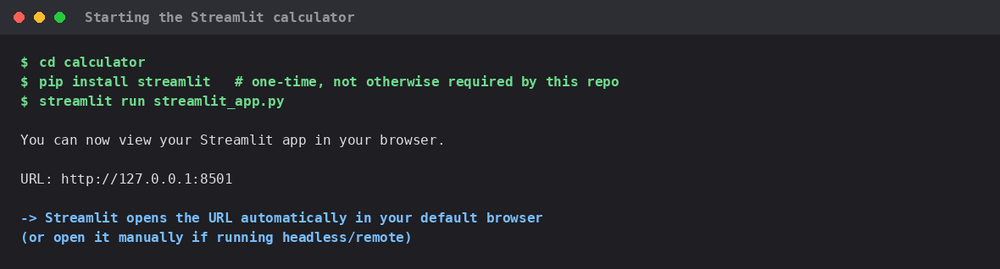
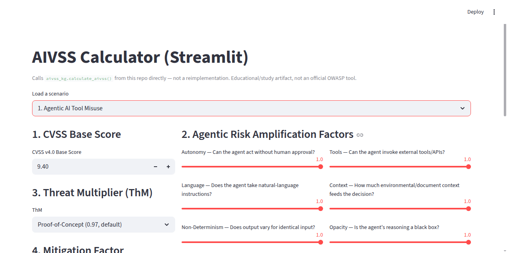
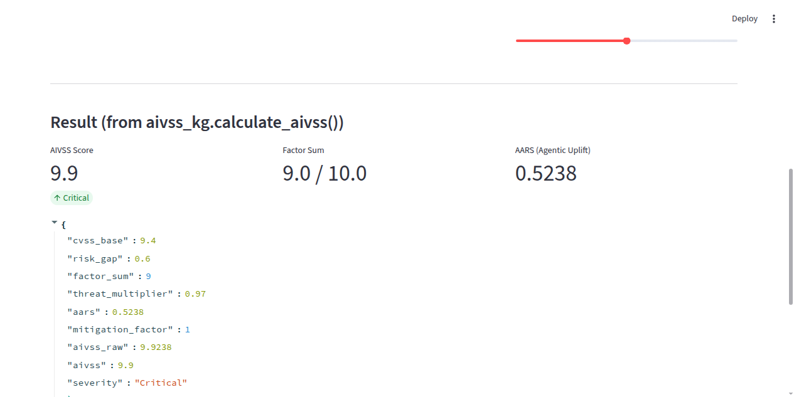

# AIVSS Assessment Skills — MCP Server for Claude Code

Deterministic, LLM-free tooling for **AIVSS v0.8** (OWASP's Agentic AI
Vulnerability Scoring System) — intake & scope an AI-embedded system, triage
it against the 10 AIVSS core risks, generate audit questionnaires, score
findings, run proactive design reviews, triage threat-intel alerts, and query
a knowledge-graph layer over the risk taxonomy — all exposed as **14 MCP
tools** any MCP-capable agent (Claude Code, GPT, Qwen via llama-server, ...)
can call directly.

Built around one design principle: **the skills never call an LLM
themselves.** Every tool parses/computes/retrieves deterministically from the
OWASP AIVSS v0.8 spec (OCR'd once into `example AIVSS/.../text/page-NN.txt`,
shipped in this repo) and returns JSON-safe data plus a ready-to-use
`narrative_prompt` field. The calling agent supplies the reasoning and
narration on top of grounded, cited facts — the tools supply the facts.

## Why this exists

A generic LLM answering "what should I design against AI agent risk in this
system?" is fluent but has zero traceability — no page citation, no
guaranteed-consistent scoring, and it will happily blend invented mitigations
into an otherwise real spec. This project's live testing (see
[`example AIVSS/README.md`](example%20AIVSS/README.md) — "Live quality test")
found the reverse problem too: raw deterministic output alone reads like a
checklist, not a consultant's answer. The `narrative_prompt` field on every
tool closes that gap — it hands the calling LLM the verified facts *and*
explicit instructions for how to narrate over them without inventing new
ones.

## What's inside

| Module | Purpose |
|---|---|
| `aivss_assessment_skills.py` | 5-skill audit chain: intake → triage → questionnaire → score → assemble deliverable |
| `aivss_banking_taxonomy.py` | 5 banking/fintech AI-system archetypes with default factor hints + regulatory context |
| `aivss_spec_search.py` | Deterministic full-text search + citation over the 98-page OCR'd spec |
| `aivss_design_review.py` | Proactive, design-time risk review (1st/2nd-line "what should we build") |
| `aivss_threat_intel.py` | Maps threat/news alert text to the 10 AIVSS risks (keyword tier + semantic fallback) |
| `aivss_finding_rationale.py` | Assembles defensible grounding for narrating a scored finding |
| `aivss_spec_provenance.py` | Verifies the risk/factor catalog against the OCR'd spec, flags drift |
| `aivss_knowledge_graph.py` | In-memory graph over risks/factors/audit topics/archetypes — blind-spot detection |
| `aivss_synthesis_prompt.py` | Shared scaffold that wraps any rendered markdown with LLM narration instructions |
| `aivss_mcp_server.py` | FastMCP server wrapping all of the above as 14 stateless MCP tools |
| `aivss_kg.py`, `aivss_internal_audit.py` (repo root) | Core AIVSS scoring formula + IT-audit/COBIT lens — required dependencies of everything above |

Full authoring history, design rationale, and every live-quality-test finding
is in [`example AIVSS/README.md`](example%20AIVSS/README.md) (kept in place —
it's referenced by several module docstrings).

## Requirements

- Python 3.11+ (tested on 3.13)
- `mcp>=1.26.0` (`pip install -r requirements.txt`)
- No network access needed at runtime — all data (spec text, taxonomy) ships
  in the repo and every skill is pure Python

## Quick start

```bash
git clone https://github.com/lengtsp/aivss-skills-claudecode.git
cd aivss-skills-claudecode
pip install -r requirements.txt
```

### Use it with Claude Code

This repo ships a project-scoped [`.mcp.json`](.mcp.json), so opening Claude
Code in this directory auto-detects the server (you'll be prompted to
approve it on first use):

```json
{
  "mcpServers": {
    "aivss-assessment-skills": {
      "type": "stdio",
      "command": "python3",
      "args": ["example AIVSS/aivss_mcp_server.py"],
      "env": {}
    }
  }
}
```

Or register it yourself (user-scoped, not committed to git):

```bash
claude mcp add aivss-assessment-skills -s local -- python3 "example AIVSS/aivss_mcp_server.py"
claude mcp list                                    # health-check
claude mcp get aivss-assessment-skills              # inspect
claude mcp remove aivss-assessment-skills -s local  # undo
```

MCP servers wire into an agent's tool set at session start — register, then
start a **new** Claude Code session (or a fresh sub-agent process) to see the
`aivss_*` tools.

### Use it with any other MCP client

`aivss_mcp_server.py` is a standard stdio MCP server (FastMCP) — point any
MCP-compatible client (Claude Desktop, other agent frameworks) at:

```bash
python3 "example AIVSS/aivss_mcp_server.py"
```

## The 14 MCP tools

| Tool | What it does |
|---|---|
| `aivss_intake_and_triage` | Scope a system + triage all 10 AIVSS risks against it |
| `aivss_generate_questionnaire` | Fillable scoping/control questionnaire for given risk keys |
| `aivss_score_finding` | Score one confirmed finding (CVSS + 10 AIVSS factors → AIVSS value) |
| `aivss_assemble_audit_deliverable` | Full intake→triage→questionnaire→score→deliverable chain, rendered + narration prompt |
| `aivss_classify_banking_system` | Classify free text against 5 banking/fintech AI archetypes |
| `aivss_search_spec` | Keyword search over the 98 OCR'd spec pages |
| `aivss_cite_spec_reference` | Cite spec pages for a risk key, factor key, or freeform topic |
| `aivss_design_review` | Design-time risk-by-risk mitigations + spec citations + narration prompt |
| `aivss_triage_threat_alert` | Map a threat/news alert to the AIVSS risks it plausibly concerns |
| `aivss_draft_finding_rationale` | Score + assemble organization-context rationale grounding |
| `aivss_spec_provenance_report` | Verify the risk/factor catalog against the spec, flag drift |
| `aivss_related_risks` | Other risks structurally connected to a given risk |
| `aivss_find_blind_spot_risks` | Given already-triaged risks, find structurally-connected risks that may be a blind spot |
| `aivss_graph_export` | Export the taxonomy graph in a Neo4j/knowledge-graph-compatible shape |

Every tool is **stateless** — callers re-supply scope/triage as plain JSON on
every call — and **fails closed**: incomplete input returns `null`/`[]`/a
validation error, never a guessed score.

## Example prompts (once registered with Claude Code)

```
Use aivss_intake_and_triage to triage an autonomous SOAR/EDR incident
response agent that isolates hosts and revokes credentials without human
approval.

Run aivss_design_review for a KYC onboarding chatbot, then call
aivss_find_blind_spot_risks on the top 3 triaged risks.

Score a finding: risk=tool_misuse, cvss_base=8.5, with these 10 factor
levels ... then draft the rationale for it.
```

## Verified correctness

- **88/88 unit tests** across 11 self-contained test runners (no pytest,
  each prints a JSON pass/fail summary):
  ```bash
  python3 "example AIVSS/test_aivss_assessment_skills.py"
  python3 "example AIVSS/test_aivss_spec_search.py"
  python3 "example AIVSS/test_aivss_design_review.py"
  python3 "example AIVSS/test_aivss_threat_intel.py"
  python3 "example AIVSS/test_aivss_finding_rationale.py"
  python3 "example AIVSS/test_aivss_spec_provenance.py"
  python3 "example AIVSS/test_aivss_synthesis_prompt.py"
  python3 "example AIVSS/test_aivss_knowledge_graph.py"
  python3 "example AIVSS/test_aivss_mcp_server.py"
  python3 "example AIVSS/test_aivss_owasp_calculator_cross_validation.py"
  python3 "example AIVSS/test_aivss_ten_risk_design_playbook.py"
  ```
- **17/17 checks** driving the real MCP JSON-RPC protocol over a subprocess
  (`test_aivss_mcp_protocol_smoke.py`) — catches wire-format/schema bugs the
  in-process tests can't.
- **10/10 official OWASP worked scenarios match exactly** against the
  live reference calculator (`test_aivss_owasp_calculator_cross_validation.py`)
  — the scoring formula is independently verified, not just self-consistent.
- **Two standalone web calculators** implementing this same formula, so it
  can be checked visually: `calculator/index.html` (static, formula
  reimplemented in JS) and `calculator/streamlit_app.py` (calls
  `aivss_kg.calculate_aivss()` directly — no reimplementation, can't drift).
  Both tested automated 10/10 against the official scenarios and found
  **identical to each other and to the Python source of truth, no
  differences**; `index.html` also spot-checked live, in real time, against
  [aivss.parthsohaney.online](https://aivss.parthsohaney.online/) (2/2
  match), plus a review of
  [aivss.owasp.org/ssvc.html](https://aivss.owasp.org/ssvc.html) confirming
  it's a genuinely different, non-comparable tool (categorical decision
  outcome, not a 0–10 score). `calculator/README.md`'s "Quick start" section
  has real terminal captures for launching each service plus a matching
  example-calculation screenshot for both, all 10 official scenarios
  verified live against the reference site (not just a spot check), and a
  low-severity SSVC check confirming its decision matrix responds correctly
  across its own range — 15 screenshots total.
- All of the above re-verified standalone from a clean checkout of this
  exact repo layout before publishing.
- **Live, end-to-end screenshots** of 7 distinct **agentic AI** cases (each
  naming a concrete autonomous action — auto-approve, auto-disburse,
  auto-freeze, auto-trade, auto-isolate, ...), driven by **plain
  natural-language prompts** (never naming a tool or using
  `parameter=value` syntax — Claude picks the tools itself) and covering
  13 of the 14 MCP tools, called from brand-new, non-interactive Claude
  Code sessions against a fresh `git clone` (real commands, real model
  output, not staged — every tool call verified via
  `--output-format stream-json`, not just claimed). The remaining tool
  (`aivss_spec_provenance_report`) is a catalog/grounding utility rather
  than an agent-scenario tool, so it's verified by the automated test suite
  instead of a case screenshot — see the
  [Screenshots](#screenshots) section below, or the full captioned gallery at
  [`example AIVSS/mcp_test_screenshots/README.md`](example%20AIVSS/mcp_test_screenshots/README.md).
  Surfaced one real limitation along the way: `aivss_classify_banking_system`
  is English-keyword-only and fails closed to `null` on Thai-language input.

## Calculator — a web UI wrapping the real Python formula

`calculator/streamlit_app.py` puts a web UI directly on top of this repo's
own `aivss_kg.calculate_aivss()` — it **imports and calls the real Python
function**, not a JavaScript reimplementation, so the UI can never drift
from the actual scoring code.

Starting it:



The form (10 factor sliders, CVSS base, Threat Multiplier, Mitigation
Factor, plus a "Load a scenario" shortcut for all 10 official v0.8 worked
examples):



Tested — result for scenario 1 (Agentic AI Tool Misuse), with the raw
`calculate_aivss()` return value shown directly in the expandable JSON
block (`aivss: 9.9`, `severity: "Critical"`, matching the official worked
example exactly):



Also tested against custom, non-official inputs and a boundary edge case
(CVSS 0.0, all factors 0 → 0.0 "None") via real UI clicks rather than the
scenario shortcut — see `calculator/README.md` for the full test log,
comparison against the JS-only `index.html` version, and the live
comparison against [aivss.parthsohaney.online](https://aivss.parthsohaney.online/).

## Screenshots

**AIVSS scores agentic AI systems specifically** — AI that acts
autonomously, calls tools, holds memory/context, or orchestrates other
agents — not generic ML models or classifiers. Every screenshot below names
a concrete autonomous action the AI agent takes on its own (approve,
disburse, freeze, trade, isolate a host, ...), so the risk taxonomy has
something real to attach to.

**The prompts are plain natural-language requests — the way a real
internal auditor would actually type — never an API call.** No prompt names
an `aivss_*` tool or uses `parameter=value` syntax; Claude picks which tools
to call, in what order, entirely on its own. Each image shows the exact
prompt sent verbatim, a `[tools invoked]` line proving which real MCP tool
calls happened (extracted from the raw session stream, not just claimed),
and the actual response.

Real terminal captures, run from a **fresh `git clone`** of this repo in
**brand-new, non-interactive Claude Code sessions**, not the original
authoring session. Full captions and the complete 8-image gallery are in
[`example AIVSS/mcp_test_screenshots/README.md`](example%20AIVSS/mcp_test_screenshots/README.md).

**Fresh clone + setup** — `.mcp.json` auto-registers the server, no manual
`claude mcp add` needed:


**Agentic case — Trade Finance L/C Auto-Disbursement Agent** — prompt: *"I'm
an internal auditor looking at... the Trade Finance L/C agent... automatically
pays out the exporter... assess this... score a real finding... one audit
deliverable"* → Claude chained 5 tool calls on its own
(`aivss_intake_and_triage` → `aivss_generate_questionnaire` →
`aivss_score_finding` → `aivss_assemble_audit_deliverable`) and scored a
forged-document finding **AIVSS 9.1 Critical**:


**Agentic case — AI Treasury Dealing Assistant** — prompt: *"We're designing
an AI Treasury Dealing Assistant... it can actually place trade orders...
without a second trader confirming... can you do a design review?"* → Claude
ran the design review, then **on its own** checked for blind-spot risks and
flagged Supply Chain Risk connected to the top risk — nobody asked for a
blind-spot check:


**Agentic case — Autonomous SOAR/EDR Incident-Response Agent** — prompt:
*"I just read about a new attack technique... tricks autonomous SOAR/EDR
response agents into auto-isolating legitimate hosts... which AI agent
risks does this map to, and how confident are you?"* → the threat-intel
tool itself only returned "possible"-confidence matches, and Claude
independently cross-checked with direct spec search before answering,
citing exact page numbers rather than trusting the weaker result outright:


**Agentic case — Agent That Inherited an Admin Role** — prompt: *"We found
that one of our AI agents ended up with an inherited admin service-account
role... draft a defensible rationale... check whether there's a blind
spot... show me the risk graph"* → 7 tool calls chained automatically,
scored **AIVSS 8.9 High**, and explained *why* existing controls (access
review, SSO+MFA) don't close the finding, grounded in the tool's own
`evidence_gap` output:


**Agentic case — Credit Scoring & Loan Underwriting Agent** — prompt: *"I'm
assessing an AI credit-scoring and loan-underwriting agent... automatically
approves or rejects loans up to 500,000 baht... score a real finding"* →
scored **AIVSS 9.1 Critical**:


See the [gallery](example%20AIVSS/mcp_test_screenshots/README.md) for all 8
screenshots — 7 distinct agentic AI cases plus setup — covering KYC
onboarding and AML/fraud auto-freeze too, each with the full prompt, the
verified tool-call sequence, and a caption explaining the result. **13 of
14 MCP tools** are now demonstrated this way, up from 11 with the earlier
explicit tool-call-syntax prompts — natural prompts turned out to make
Claude reach for `aivss_search_spec` and `aivss_cite_spec_reference`
directly, mid-conversation, not just internally through other tools.

## Scope & honesty notes

- **AIVSS v0.8 has no dedicated "mitigations" section per risk** — the spec's
  per-risk content is DESCRIPTION + KEY RISKS + EXAMPLE ATTACK SCENARIOS
  only. `DESIGN_MITIGATIONS` in `aivss_design_review.py` is authored guidance
  grounded in each risk's real KEY RISKS bullets, not a transcription — treat
  it as a starting checklist, not an authoritative catalog. This is stated
  directly in every rendered design review's `proof_boundary` field.
- **Citations ground the risk description, not individual mitigations** —
  rendered output and `narrative_prompt` text both say this explicitly, so a
  narrating LLM doesn't imply a specific mitigation is spec-sourced when it
  isn't.
- **Threat-intel triage has a documented precision/recall tradeoff** — a
  fixed keyword tier plus a weaker, separately-labeled semantic fallback tier
  (`confidence: "possible"`), never blended into the keyword tier's scores.
- No PII, credentials, or proprietary source-code from the parent project
  are in this repo — only the AIVSS skill modules, the OCR'd spec text
  derived from the public OWASP AIVSS v0.8 PDF, and this documentation.
- **The source PDF and page scans (`.jpg`) are intentionally not included.**
  No tool in this repo opens the PDF or any `.jpg` at runtime — every skill
  reads the OCR'd `text/page-NN.txt` corpus only (see `aivss_spec_search.py`).
  The PDF is only referenced elsewhere as a filename/URL string for
  provenance display (`aivss_spec_provenance.py`'s `SPEC_SOURCE_URL`, which
  points at the official OWASP-hosted copy) — never read as a file. Get the
  original from `https://aivss.owasp.org/` if you need it; both are
  `.gitignore`d here to keep the repo lean.

## Repository layout

```
aivss-assessment-skills/
├── aivss_kg.py                 # core AIVSS scoring formula + risk/factor definitions
├── aivss_internal_audit.py     # IT-audit/COBIT lens (audit topics, output options)
├── requirements.txt
├── .mcp.json                   # Claude Code project-scoped MCP registration
├── calculator/                 # index.html (JS) + streamlit_app.py (calls calculate_aivss()
│                                # directly) -- both tested against aivss.parthsohaney.online + ssvc.html
└── example AIVSS/              # skill modules, tests, docs (folder name is load-bearing —
    ├── aivss_*.py               # see aivss_kg.py's DEFAULT_SOURCE_DIR — do not rename)
    ├── test_aivss_*.py
    ├── README.md                # full authoring history / design rationale / live test log
    ├── SKILLS_ROADMAP.md        # design analysis this skill set was built from
    ├── deliverables/            # rendered worked-example audit deliverables
    ├── design_playbook/         # 10 rendered design-review use cases (one per core risk)
    ├── mcp_test_screenshots/    # live agentic-AI-case test screenshots, captioned gallery
    ├── owasp_general_aivss_framework/  # OWASP's official V1-V4 calculators (vendored,
    │                                   # different formula from this repo's own — see its README)
    └── AIVSS Scoring System For OWASP Agentic AI Core Security Risks v0.8 (1)_pages/
        └── text/                # 98-page OCR'd spec text (the search corpus every tool reads —
                                  # the source PDF and jpg/ page scans are not shipped, see above)
```

`example AIVSS/` keeps its original name and nesting deliberately — several
modules resolve paths relative to it (`Path(__file__).resolve().parents[1]`),
and renaming it would require coordinated edits across every module and test.

## Source & Attribution

This project builds on, and its `example AIVSS/.../text/` corpus is an OCR'd
reproduction of, the official OWASP publication:

- **Document:** *AIVSS Scoring System For OWASP Agentic AI Core Security
  Risks*
- **Version:** v0.8 (a released publication — verified against the source
  text and the official site, not a draft)
- **Published / last modified:** 2026-04-10 (per the official site's HTTP
  `Last-Modified` header on the PDF asset)
- **Official source:** <https://aivss.owasp.org/>
- **Publisher:** OWASP Foundation, Inc.

Per OWASP's site-wide license notice: *"Unless otherwise specified, all
content on the site is Creative Commons Attribution-ShareAlike v4.0 and
provided without warranty of service or accuracy."* (OWASP, Copyright 2026,
OWASP Foundation, Inc. — <https://policy.owasp.org/operational/general-disclaimer.html>)
"OWASP" and the OWASP logo are registered trademarks of the OWASP
Foundation, Inc.; this project is not affiliated with or endorsed by OWASP.

Exact version/date pins live in code, not just this README, so they can be
re-verified programmatically: `SPEC_VERSION`, `SPEC_PUBLISHED_DATE`,
`SPEC_SOURCE_FILENAME`, `SPEC_SOURCE_URL` in `example AIVSS/aivss_spec_provenance.py`,
surfaced live via the `aivss_spec_provenance_report` MCP tool.

Separately, `example AIVSS/owasp_general_aivss_framework/` vendors and
adapts material from two official OWASP sources:

- [`github.com/OWASP/www-project-artificial-intelligence-vulnerability-scoring-system`](https://github.com/OWASP/www-project-artificial-intelligence-vulnerability-scoring-system)
  (commit `62fb0be`, 2026-04-10)
- [`aivss.owasp.org/assets/publications/AIVSS Scoring System For OWASP Agentic AI Core Security Risks v0.8.pdf`](https://aivss.owasp.org/assets/publications/AIVSS%20Scoring%20System%20For%20OWASP%20Agentic%20AI%20Core%20Security%20Risks%20v0.8.pdf)

**This corresponds to v0.8 only** — re-verify against the source before
assuming anything here still applies once OWASP publishes a later version.
Vendoring, organization, the formula-difference analysis, the
non-interactive test harness, and the accompanying documentation and test
screenshots were done using **Claude Code (Sonnet 5)**; the calculator
`.py`/`.md`/`.html` files themselves are unmodified copies. **These
calculators implement a different, more general AIVSS methodology than the
Agentic Core Risks formula this repo uses** — see that folder's own README
for the full explanation, a side-by-side formula comparison, and screenshots
from actually running all 4 official calculator versions (a genuine finding:
every version compresses scores toward the low end of the scale, even on
deliberately worst-case/Critical inputs).

## License

**Educational / study use only.** This repository was built to learn how to
implement, test, and integrate the OWASP AIVSS methodology (v0.8) as an MCP
server for Claude Code — it is not published for production use, commercial
use, or redistribution. No license is granted. Content adapted from OWASP
(see "Source & Attribution" above) remains OWASP's own work, used here for
study and attributed accordingly.
