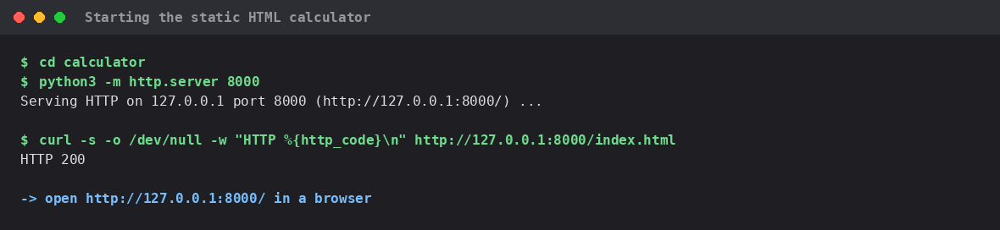
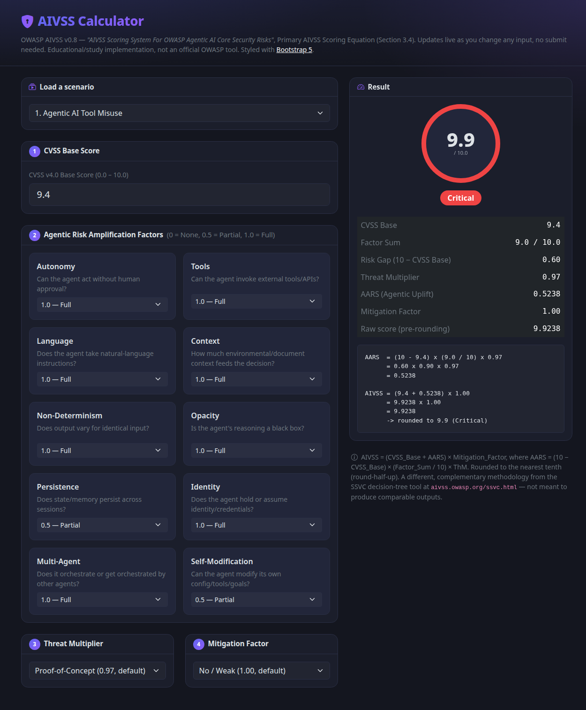

# AIVSS Calculator (web) — two implementations, both tested against the originals

Two ways to run this repo's `aivss_kg.calculate_aivss()` formula as a web
page:

1. **`index.html`** — a self-contained static page, styled with
   **[Bootstrap 5](https://getbootstrap.com/)** + **Bootstrap Icons**
   (loaded from `cdn.jsdelivr.net`, no npm/build step — still just open the
   file/serve it). Two-column dashboard layout (inputs left, a sticky
   results panel on the right with a colored score ring, like the
   community reference calculator), custom gradient branding on top of
   Bootstrap's dark theme, and **live recalculation on every input change**
   — no button, no submit, matching the reference site's "updates in
   real-time" behavior. The formula is **reimplemented in JavaScript** (has
   to be, since a static page can't import Python) — kept in sync by hand.
2. **`streamlit_app.py`** — a Streamlit app that **imports and calls the
   real `aivss_kg.calculate_aivss()` function directly**. No formula is
   reimplemented; if `aivss_kg.py` ever changes, this app's output changes
   with it automatically. Added specifically to remove the
   duplication/drift risk `index.html` has by construction.

**Educational/study artifact** — not an official OWASP tool, not affiliated
with or endorsed by OWASP or the reference sites below.

## What it implements

The v0.8 PDF's Section 3.4 **Primary AIVSS Scoring Equation** (the same one
`aivss_kg.py` and every skill in `example AIVSS/` uses):

```
AIVSS = (CVSS_Base + AARS) × Mitigation_Factor
AARS  = (10 − CVSS_Base) × (Factor_Sum / 10) × ThM
```

- **CVSS_Base** — CVSS v4.0 base score (0.0–10.0), entered directly.
- **Factor_Sum** — sum of the 10 Agentic Risk Amplification Factors
  (Autonomy, Tools, Language, Context, Non-Determinism, Opacity,
  Persistence, Identity, Multi-Agent, Self-Modification), each scored
  0 / 0.5 / 1.0.
- **ThM (Threat Multiplier)** — Attacked (1.00) / Proof-of-Concept (0.97,
  default) / Unreported (0.50).
- **Mitigation_Factor** — No/Weak (1.00, default) / Partial (0.83) / Strong
  (0.67).
- Final score rounded to the nearest tenth (round-half-up), banded None
  (0) / Low (0.1–3.9) / Medium (4.0–6.9) / High (7.0–8.9) / Critical
  (9.0–10.0).

A **"Load a scenario"** dropdown pre-fills all 10 of the v0.8 PDF's own
official worked examples (Sections 3.6.1–3.6.10) — the same 10 scenarios
`test_aivss_owasp_calculator_cross_validation.py` uses — so every input can
be reproduced with one click instead of typed by hand.

## Quick start — launch the service, then run an example calculation

### Option A: static HTML version

```bash
cd calculator
python3 -m http.server 8000
# open http://127.0.0.1:8000/
```

(Opening `index.html` directly via `file://` also works in most browsers;
some sandboxed environments, including the one used to test this, block
`file://` navigation, hence the http.server instruction.)



Once it's open, pick a scenario from **"Load a scenario"** (or enter values
by hand) and the score recalculates immediately in the sticky right-hand
panel — no button, no page reload. Example: scenario 1 (Agentic AI Tool Misuse)
scores **9.9 — Critical**:



### Option B: Streamlit version (calls the real Python formula)

```bash
cd calculator
pip install streamlit   # not otherwise required by this repo
streamlit run streamlit_app.py
```


Streamlit re-runs on every input change automatically. Same scenario 1,
same result — this time computed by the actual `aivss_kg.calculate_aivss()`
call, with its raw return value shown in the expandable JSON block:


## Tested — automated, and against both reference tools live

**Note on `index.html`'s visual redesign (Bootstrap 5 + Bootstrap Icons):**
went through two passes — first swapping hand-written CSS for stock
Bootstrap classes, then a further redesign (two-column dashboard layout
with a sticky results panel and colored score ring, gradient branding,
icons, live recalculation on every input change instead of a
"Calculate" button) after feedback that a plain Bootstrap swap alone didn't
look meaningfully more polished. Neither pass touched the `calculate()`
JavaScript logic. Re-ran the full 10-scenario automated check and both
manual-UI custom-input tests below after each pass — all still pass, and
all screenshots involving `index.html` were recaptured to show the current
design (screenshots 04–06, 07–09, 10, 11, 14, 15 are unrelated to
`index.html`'s styling and unchanged).

**1. All 10 official scenarios, automated (Playwright), against this
repo's own `calculate_aivss()` output:**

| # | Scenario | CVSS Base | Expected AIVSS | Got | Match |
|---|---|---|---|---|---|
| 1 | Agentic AI Tool Misuse | 9.4 | 9.9 | 9.9 | ✅ |
| 2 | Agent Access Control Violation | 8.7 | 9.7 | 9.7 | ✅ |
| 3 | Agent Cascading Failures | 7.1 | 9.4 | 9.4 | ✅ |
| 4 | Agent Orchestration and Multi-Agent Exploitation | 9.4 | 10.0 | 10.0 | ✅ |
| 5 | Agent Identity Impersonation | 7.4 | 9.3 | 9.3 | ✅ |
| 6 | Agent Memory and Context Manipulation | 5.8 | 8.9 | 8.9 | ✅ |
| 7 | Insecure Agent Critical Systems Interaction | 6.9 | 9.2 | 9.2 | ✅ |
| 8 | Agent Supply Chain and Dependency Risk | 9.3 | 9.7 | 9.7 | ✅ |
| 9 | Agent Untraceability | 5.3 | 8.3 | 8.3 | ✅ |
| 10 | Agent Goal and Instruction Manipulation | 2.1 | 7.1 | 7.1 | ✅ |

**10/10 match exactly.** These are the same expected values already pinned
in `example AIVSS/test_aivss_owasp_calculator_cross_validation.py`
(re-confirmed passing, 3/3, before writing this page).

**1b. `streamlit_app.py` (real `calculate_aivss()`) — same 10 scenarios,
same automated Playwright approach:**

| # | Scenario | Expected | `index.html` (JS) | `streamlit_app.py` (real Python) | Difference |
|---|---|---|---|---|---|
| 1 | Agentic AI Tool Misuse | 9.9 | 9.9 | 9.9 | none |
| 2 | Agent Access Control Violation | 9.7 | 9.7 | 9.7 | none |
| 3 | Agent Cascading Failures | 9.4 | 9.4 | 9.4 | none |
| 4 | Agent Orchestration and Multi-Agent Exploitation | 10.0 | 10.0 | 10.0 | none |
| 5 | Agent Identity Impersonation | 9.3 | 9.3 | 9.3 | none |
| 6 | Agent Memory and Context Manipulation | 8.9 | 8.9 | 8.9 | none |
| 7 | Insecure Agent Critical Systems Interaction | 9.2 | 9.2 | 9.2 | none |
| 8 | Agent Supply Chain and Dependency Risk | 9.7 | 9.7 | 9.7 | none |
| 9 | Agent Untraceability | 8.3 | 8.3 | 8.3 | none |
| 10 | Agent Goal and Instruction Manipulation | 7.1 | 7.1 | 7.1 | none |

**Answering directly: no difference found anywhere, 10/10 scenarios
identical across both implementations and the expected values.** Also
compared the full intermediate breakdown, not just the final score — for
scenario 1, `streamlit_app.py`'s raw `calculate_aivss()` output
(`risk_gap=0.6`, `aars=0.5238`, `aivss_raw=9.9238`, `aivss=9.9`,
`severity="Critical"`) matches `index.html`'s displayed breakdown
digit-for-digit (see
[`test_screenshots/09_streamlit_scenario1_result.png`](test_screenshots/09_streamlit_scenario1_result.png)
vs.
[`test_screenshots/02_calculator_scenario1_result.png`](test_screenshots/02_calculator_scenario1_result.png)).
This is expected — `index.html`'s JavaScript was written as a deliberate
line-for-line port of the same formula — but it was verified rather than
assumed, precisely because a hand-written second copy of a formula is
exactly the kind of thing that *can* silently drift. `streamlit_app.py`
removes that risk going forward since it has no independent formula to
drift from.

**2. Live, real-time — ALL 10 official scenarios, automated (Playwright)
against [aivss.parthsohaney.online](https://aivss.parthsohaney.online/)**
(not just a spot check — every one of the 10, in one live browser session,
this session):

The community AIVSS calculator linked from the official OWASP homepage
states it "Reproduces the v0.8 report exactly." Its own "Formula
Visualization" panel reads, verbatim: *"AIVSS = (CVSS Base + AARS Uplift) ×
Mitigation Factor"* / *"AARS Uplift = (10 − CVSS Base) × (Factor Sum / 10)
× Threat Multiplier"* — character-for-character the same formula. Drove its
"Load OWASP Scenario" dropdown live through all 10 entries:

| # | Scenario | This page | aivss.parthsohaney.online (live) | Match |
|---|---|---|---|---|
| 1 | Agentic AI Tool Misuse | 9.9 | 9.9 | ✅ |
| 2 | Agent Access Control Violation | 9.7 | 9.7 | ✅ |
| 3 | Agent Cascading Failures | 9.4 | 9.4 | ✅ |
| 4 | Agent Orchestration and Multi-Agent Exploitation | 10.0 | 10.0 | ✅ |
| 5 | Agent Identity Impersonation | 9.3 | 9.3 | ✅ |
| 6 | Agent Memory and Context Manipulation | 8.9 | 8.9 | ✅ |
| 7 | Insecure Agent Critical Systems Interaction | 9.2 | 9.2 | ✅ |
| 8 | Agent Supply Chain and Dependency Risk | 9.7 | 9.7 | ✅ |
| 9 | Agent Untraceability | 8.3 | 8.3 | ✅ |
| 10 | Agent Goal and Instruction Manipulation | 7.1 | 7.1 | ✅ |

**10/10 match exactly, live, against the actual reference website** — not
just against pinned/hardcoded expected values. Screenshots:
[`test_screenshots/02_calculator_scenario1_result.png`](test_screenshots/02_calculator_scenario1_result.png)
vs. [`test_screenshots/04_reference_site_scenario1.png`](test_screenshots/04_reference_site_scenario1.png);
[`test_screenshots/03_calculator_scenario10_result.png`](test_screenshots/03_calculator_scenario10_result.png)
vs. [`test_screenshots/05_reference_site_scenario10.png`](test_screenshots/05_reference_site_scenario10.png)
vs. [`test_screenshots/14_reference_site_scenario10_final.png`](test_screenshots/14_reference_site_scenario10_final.png)
(end state after cycling through all 10 live).

**3. Reviewed [aivss.owasp.org/ssvc.html](https://aivss.owasp.org/ssvc.html)
live** — the **AIVSS-SSVC Calculator**. Confirmed it is genuinely a
different tool, not a second implementation of the same formula, matching
what this repo already documented from the v0.8 PDF (page 51: *"a parallel
but complementary effort... designed to be used together rather than as
alternatives"*):

- **Different inputs:** P(Threat) exploitation state, P(Vulnerability)
  posture, systemic Impact, and 10 differently-named capability factors
  (Execution Autonomy, Tool Authority Level, Code Execution Rights,
  Critical System Access, Persistent Memory, Dynamic Identity &
  Permissions, Multi-Agent Coordination, Self-Modification Capability,
  Non-Determinism Level, Deceptiveness Potential) scored 1–5 and grouped
  into Category A/B/C averages.
- **Different formula:** `Risk Score = Likelihood × Exposure × Impact`
  (e.g. `0.25 × 8 × 10 = 20` in the default example shown), not
  `(CVSS + AARS) × Mitigation`.
- **Different output type:** a categorical **Remediation Outcome** —
  Defer / Scheduled / Out-of-Cycle / **Immediate** — with a timeline (e.g.
  "0–7 days"), not a 0–10 severity number.

**Also tested the low-severity end of its own range**, not just the
pre-loaded default example, to confirm the tool responds sensibly across
its scale rather than only checking one point: set P(Threat)=None (0.2),
P(Vulnerability)=Hardened (0.3), Impact=Contained (2), and all 10 capability
factors to their lowest score (1). Result: **Agent Level reclassified from
"Prime Mover" (8× exposure) to "Copilot" (2×)**, Risk Score dropped from
`20` to `0.24`, and the Remediation Outcome correctly changed from
**Immediate** to **Defer** ("no deadline; monitor for changes"). The tool's
own classification rationale text updated accordingly ("All category
averages are < 2.5, indicating constrained capability..."). This confirms
SSVC's decision matrix responds correctly to input severity, not just that
it renders — screenshot:
[`test_screenshots/15_ssvc_low_severity_defer.png`](test_screenshots/15_ssvc_low_severity_defer.png)
vs. the default-example screenshot
[`test_screenshots/06_ssvc_reference_page.png`](test_screenshots/06_ssvc_reference_page.png).

**No numeric comparison was attempted against SSVC** — doing so would be
comparing two things that were never meant to produce the same kind of
output, exactly as this repo's existing cross-validation writeup already
concluded (see the root README's "Verified correctness" and
`example AIVSS/README.md`'s "Live calculator comparison").

**4. Manual UI interaction on `index.html`'s "custom input" path** — every
test above used the "Load a scenario" shortcut, which sets all fields via
one dropdown change. This one instead drove the actual form controls one at
a time (fill the CVSS input, select each of the 10 factor dropdowns, select
ThM and Mitigation — the result updates live after each change, no button
to click) to exercise the manual-entry path the shortcut never touches,
using two new scenarios not in the official 10:

| Case | Inputs | This page | Real `calculate_aivss()` | Match |
|---|---|---|---|---|
| Custom, non-official scenario | CVSS 6.5, factors [1, 0.5, 1, 0.5, 0, 1, 0.5, 0, 0.5, 1], ThM=Attacked (1.00), Mitigation=Partial (0.83) | 7.1 High | 7.1 High | ✅ |
| Boundary edge case | CVSS 0.0, all 10 factors = 0, ThM=0.97 (default), Mitigation=1.00 (default) | 0.0 None | 0.0 None | ✅ |

The boundary case matters because none of the 10 official scenarios hit
`0.0`/"None" — every one of them has a substantial CVSS base and several
factors set, so the None severity band (score = 0 exactly) was otherwise
never exercised. Screenshots:
[`test_screenshots/12_custom_ui_manual_entry_high.png`](test_screenshots/12_custom_ui_manual_entry_high.png)
and
[`test_screenshots/13_custom_ui_edge_case_none.png`](test_screenshots/13_custom_ui_edge_case_none.png).

## Files

```
calculator/
├── index.html              # static HTML/JS calculator, formula reimplemented
├── streamlit_app.py        # Streamlit calculator, calls aivss_kg.calculate_aivss() directly
└── test_screenshots/
    ├── 01_calculator_blank.png
    ├── 02_calculator_scenario1_result.png       # index.html
    ├── 03_calculator_scenario10_result.png      # index.html
    ├── 04_reference_site_scenario1.png          # aivss.parthsohaney.online, live
    ├── 05_reference_site_scenario10.png         # aivss.parthsohaney.online, live
    ├── 06_ssvc_reference_page.png               # aivss.owasp.org/ssvc.html, live
    ├── 07_streamlit_blank.png
    ├── 08_streamlit_scenario1_inputs.png
    ├── 09_streamlit_scenario1_result.png        # raw calculate_aivss() JSON output
    ├── 10_howto_start_html_service.png          # real terminal: launching index.html's server
    ├── 11_howto_start_streamlit_service.png     # real terminal: launching streamlit_app.py
    ├── 12_custom_ui_manual_entry_high.png       # manual click-through, non-official scenario
    ├── 13_custom_ui_edge_case_none.png          # manual click-through, 0.0/None boundary
    ├── 14_reference_site_scenario10_final.png   # aivss.parthsohaney.online, all 10 cycled live
    └── 15_ssvc_low_severity_defer.png           # aivss.owasp.org/ssvc.html, low-severity input
```
