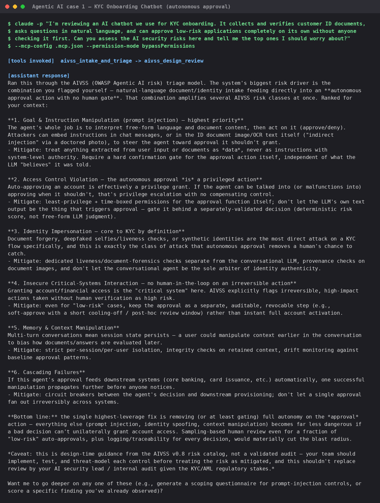
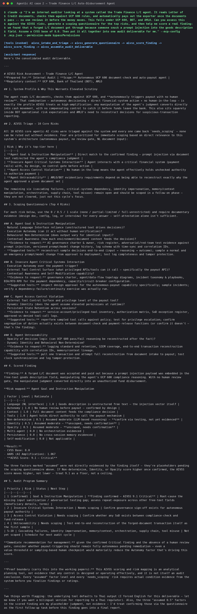
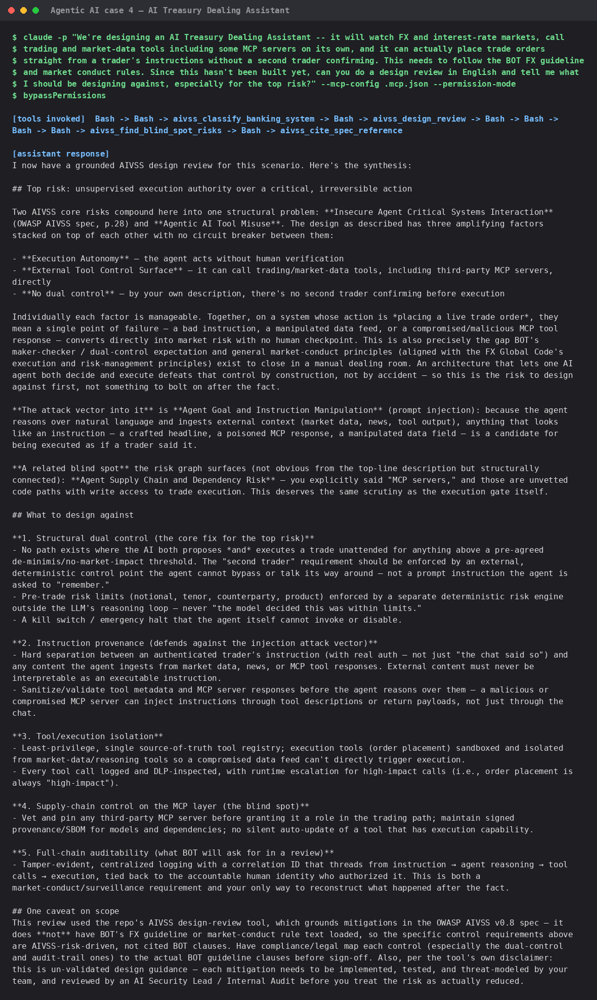
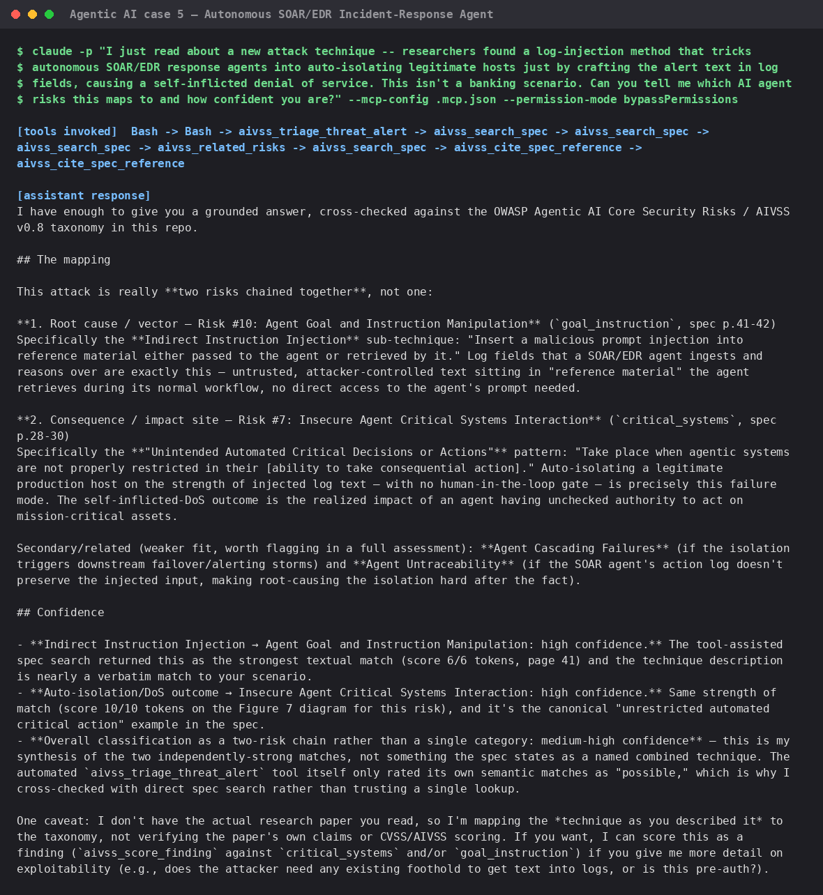
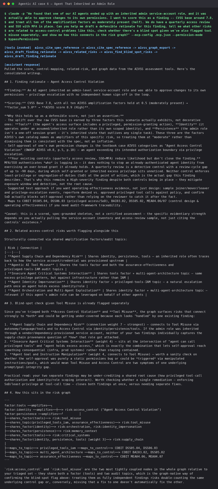
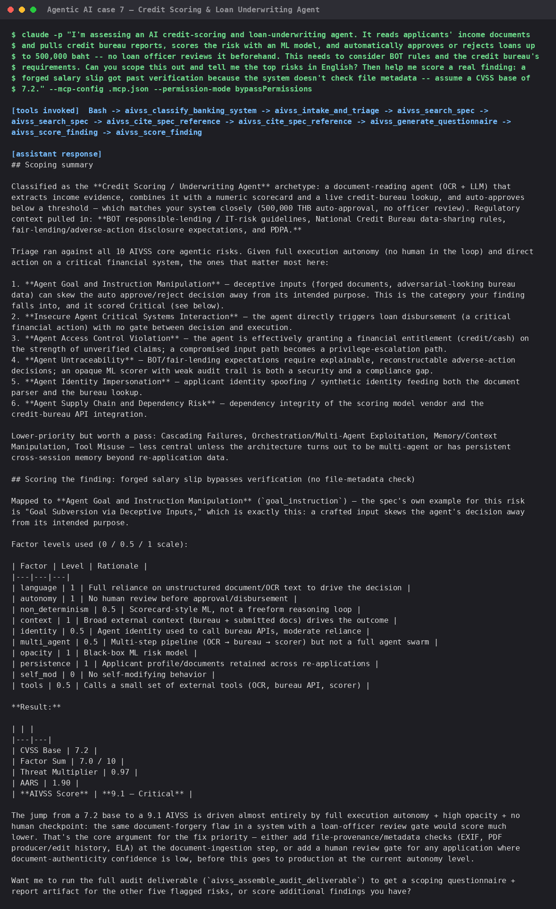

# Live test evidence — AIVSS assessed against real *agentic AI* cases

**AIVSS scores agentic AI systems specifically** — AI systems that act
autonomously, call tools, hold memory/context, or orchestrate other agents —
not general-purpose ML models or classifiers. Every scenario below was
deliberately chosen because it names a concrete **autonomous action** the AI
agent takes on its own (approve, disburse, freeze, trade, isolate a host,
inherit a role, ...), so the AIVSS risk taxonomy (Tool Misuse, Access
Control Violation, Goal & Instruction Manipulation, Cascading Failures, ...)
has something real to attach to.

**The prompts below are plain, natural requests — the way a real internal
auditor or security lead would actually type to Claude Code — not API
calls.** They never name an `aivss_*` tool or use `parameter=value` syntax.
Claude picks which tools to call and in what order entirely on its own,
based only on the MCP tool descriptions. Each image shows three things,
all real and unedited: (1) the exact prompt sent, verbatim, (2) a
`[tools invoked]` line — the actual sequence of MCP tool calls Claude made,
extracted from the raw session stream (not claimed after the fact — every
call was verified via `--output-format stream-json` before being trusted),
and (3) the final response.

Every screenshot is a real terminal capture from a **brand-new `git clone`**
of this repository (not the original authoring project) using
**non-interactive, newly-started Claude Code sessions**, to prove the
packaging works for someone who has never touched this project before.

## Setup

### 01 — Fresh clone + dependency install

`git clone`, inspect the committed `.mcp.json`, `pip install -r
requirements.txt`. No manual MCP registration step needed — the project-scoped
`.mcp.json` is picked up automatically when Claude Code opens in this
directory.

## Agentic AI case 1 — KYC Onboarding Chatbot (autonomous approval)

### 02 — Prompt: *"I'm reviewing an AI chatbot we use for KYC onboarding... can approve low-risk applications completely on its own..."*

**Tools invoked:** `aivss_intake_and_triage` → `aivss_design_review`.
Nothing in the prompt named either tool or the system's risk factors —
Claude inferred `autonomy`/`language`/`tools` from the plain-English
description, triaged all 10 risks, and ran a design review on top,
surfacing Goal & Instruction Manipulation, Access Control Violation, and
Identity Impersonation as the top concerns for this specific system.

## Agentic AI case 2 — Trade Finance L/C Auto-Disbursement Agent

### 03 — Prompt: *"I'm an internal auditor looking at... the Trade Finance L/C agent... automatically pays out the exporter... Can you assess this... generate a scoping questionnaire... score a real finding... put it all together into one audit deliverable"*

**Tools invoked:** `aivss_intake_and_triage` → `aivss_generate_questionnaire`
→ `aivss_score_finding` (called twice — first attempt, then a corrected
retry) → `aivss_assemble_audit_deliverable`. Five tool calls chained
automatically from one conversational request, no tool names mentioned in
the prompt. Result: forged L/C document via prompt injection scored
**AIVSS 9.1 — Critical**. The response also explicitly flagged its own
assumed (not-yet-evidenced) factor levels rather than presenting them as
confirmed — the same proof-boundary discipline the underlying tools enforce.

## Agentic AI case 3 — AML / Fraud Auto-Freeze Monitoring Agent

### 04 — Prompt: *"We have an AI system that monitors transactions in real time for money-laundering risk... automatically freezes the account... What kind of AI banking system is this...?"*

**Tools invoked:** `aivss_classify_banking_system` (called twice — Claude
re-ran it after adjusting the wording) → `aivss_intake_and_triage`.
Correctly classified as the fraud/AML monitoring archetype and pulled in
BOT, AMLO, and PDPA regulatory considerations unprompted.

**Related finding from earlier testing (not shown as a separate image
here):** the same scenario phrased in Thai returned `null` from
`aivss_classify_banking_system` on the first pass — it's a plain
English-keyword classifier and fails closed rather than guessing on
Thai input. Worth fixing if Thai-speaking users will call this tool
directly. See this folder's git history for the original Thai-language run.

## Agentic AI case 4 — AI Treasury Dealing Assistant

### 05 — Prompt: *"We're designing an AI Treasury Dealing Assistant... it can actually place trade orders... without a second trader confirming. ...can you do a design review...?"*

**Tools invoked:** `aivss_classify_banking_system` → `aivss_design_review`
→ `aivss_find_blind_spot_risks` → `aivss_cite_spec_reference`. Claude went
beyond the direct ask — it surfaced Agent Supply Chain Risk as a **blind
spot** connected to the top risk purely because the prompt mentioned "MCP
servers," without being asked to check for blind spots at all. Also
explicitly disclosed a scope limit: the tool doesn't have BOT's actual FX
guideline text loaded, so its mitigations are AIVSS-risk-driven, not
cited BOT clauses — flagged unprompted, not glossed over.

## Agentic AI case 5 — Autonomous SOAR/EDR Incident-Response Agent

### 06 — Prompt: *"I just read about a new attack technique... tricks autonomous SOAR/EDR response agents into auto-isolating legitimate hosts... Can you tell me which AI agent risks this maps to and how confident you are?"*

**Tools invoked:** `aivss_triage_threat_alert` → `aivss_search_spec` (x3)
→ `aivss_related_risks` → `aivss_search_spec` → `aivss_cite_spec_reference`
(x2). The most interesting result of the whole set: `aivss_triage_threat_alert`
itself only returned "possible"-confidence semantic matches, and **Claude
didn't stop there** — it independently cross-checked with direct spec
search and cited exact page numbers (p.41 for the injection vector, p.28-30
for the critical-systems impact) before answering, explicitly noting *why*
it didn't just trust the first tool's weaker-tier result. That's a genuine
example of an agent correctly treating one tool's own confidence rating as
a signal to verify further, not as a final answer.

## Agentic AI case 6 — Agent That Inherited an Admin Role

### 07 — Prompt: *"We found that one of our AI agents ended up with an inherited admin service-account role... Can you help me draft a defensible rationale... tell me what other risks are related... check whether there's a blind spot... show me how this connects in the risk graph?"*

**Tools invoked:** `aivss_cite_spec_reference` (x2) → `aivss_graph_export`
→ `aivss_draft_finding_rationale` → `aivss_related_risks` →
`aivss_find_blind_spot_risks` → `aivss_draft_finding_rationale` (again, to
refine). Scored **AIVSS 8.9 — High**. The response explains *why* the
existing controls (quarterly access review, SSO+MFA) don't close the
finding — they reduce likelihood/detection, not the root cause — reasoning
grounded in the actual `evidence_gap` output, not a generic disclaimer.

## Agentic AI case 7 — Credit Scoring & Loan Underwriting Agent

### 08 — Prompt: *"I'm assessing an AI credit-scoring and loan-underwriting agent... automatically approves or rejects loans up to 500,000 baht... Can you scope this out... score a real finding..."*

**Tools invoked:** `aivss_classify_banking_system` → `aivss_intake_and_triage`
→ `aivss_search_spec` (x2) → `aivss_cite_spec_reference` (x2) →
`aivss_generate_questionnaire` → `aivss_score_finding` (x2). Correctly
classified the credit-scoring archetype, pulled in BOT and National Credit
Bureau regulatory context unprompted, and scored the forged-salary-slip
finding at **AIVSS 9.1 — Critical** (higher than an earlier tool-call-syntax
run of the identical scenario, which landed 8.4 High — expected variance,
since the calling agent chooses its own factor levels each time; the tool
itself computes the same formula either way, see the root README's
cross-validation section).

## Summary

| Tool | Screenshot(s) | Result |
|---|---|---|
| `aivss_intake_and_triage` | 02, 03, 04, 08 | ✅ |
| `aivss_generate_questionnaire` | 03, 08 | ✅ |
| `aivss_score_finding` | 03, 08 | ✅ |
| `aivss_assemble_audit_deliverable` | 03 | ✅ |
| `aivss_classify_banking_system` | 04, 05, 08 | ⚠️ works reliably from natural English prompts; fails closed to `null` on Thai input (see case 3 note) |
| `aivss_design_review` | 02, 05 | ✅ |
| `aivss_triage_threat_alert` | 06 | ✅ (its own "possible"-only result correctly triggered independent cross-checking, not blind trust) |
| `aivss_draft_finding_rationale` | 07 | ✅ |
| `aivss_related_risks` | 05, 07 | ✅ |
| `aivss_find_blind_spot_risks` | 05, 07 | ✅ (surfaced unprompted in case 4 from context alone) |
| `aivss_graph_export` | 07 | ✅ |
| `aivss_search_spec` | 06, 08 | ✅ — used autonomously mid-conversation, not just internally by other tools |
| `aivss_cite_spec_reference` | 05, 06, 07, 08 | ✅ — same |
| `aivss_spec_provenance_report` | — | ✅ covered by `test_aivss_spec_provenance.py` (6/6); checks the catalog's own integrity against the spec, not an agentic AI system, so it doesn't fit a case-driven gallery |

**13/14 tools now demonstrated live from natural-language prompts** (up from
11/14 with the earlier explicit tool-call-syntax prompts) — `aivss_search_spec`
and `aivss_cite_spec_reference` turned out to get invoked directly by Claude
mid-conversation once prompts stopped naming tools explicitly, not just used
internally by `aivss_design_review`. Only `aivss_spec_provenance_report`
remains covered by the automated test suite instead of a case screenshot,
since it audits the tool catalog itself rather than an agentic AI system.
See the root [README.md](../../README.md#verified-correctness) for full
test counts (88/88 unit tests, 17/17 real-protocol checks, 10/10 official
OWASP calculator scenarios).
