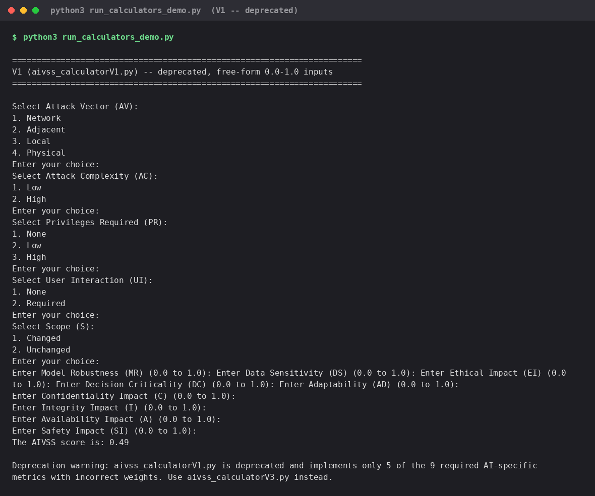
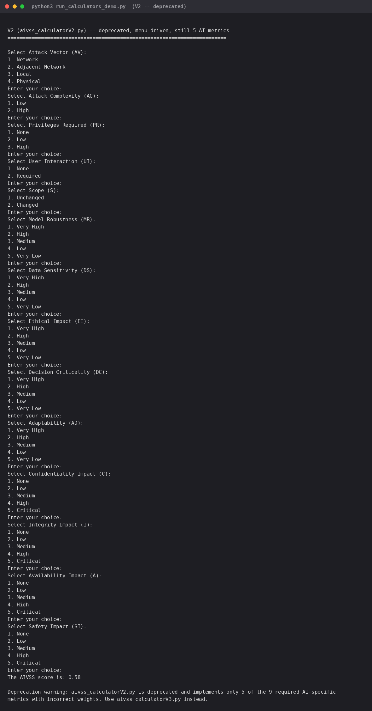
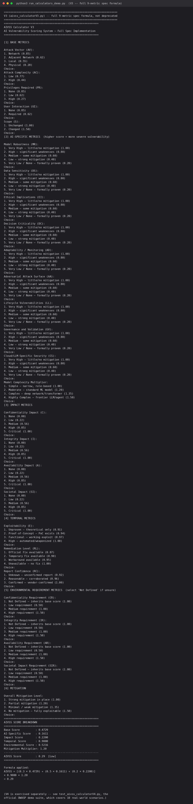
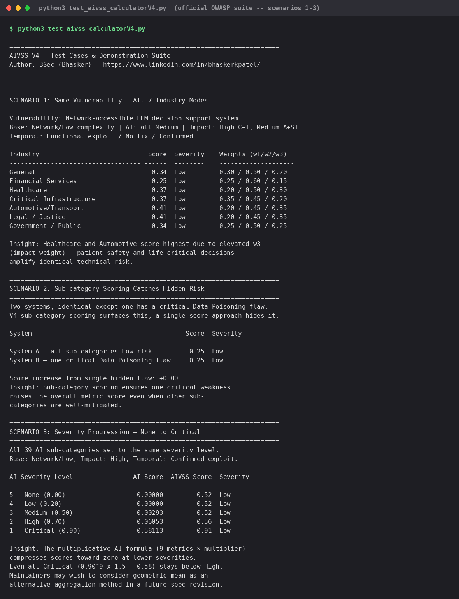
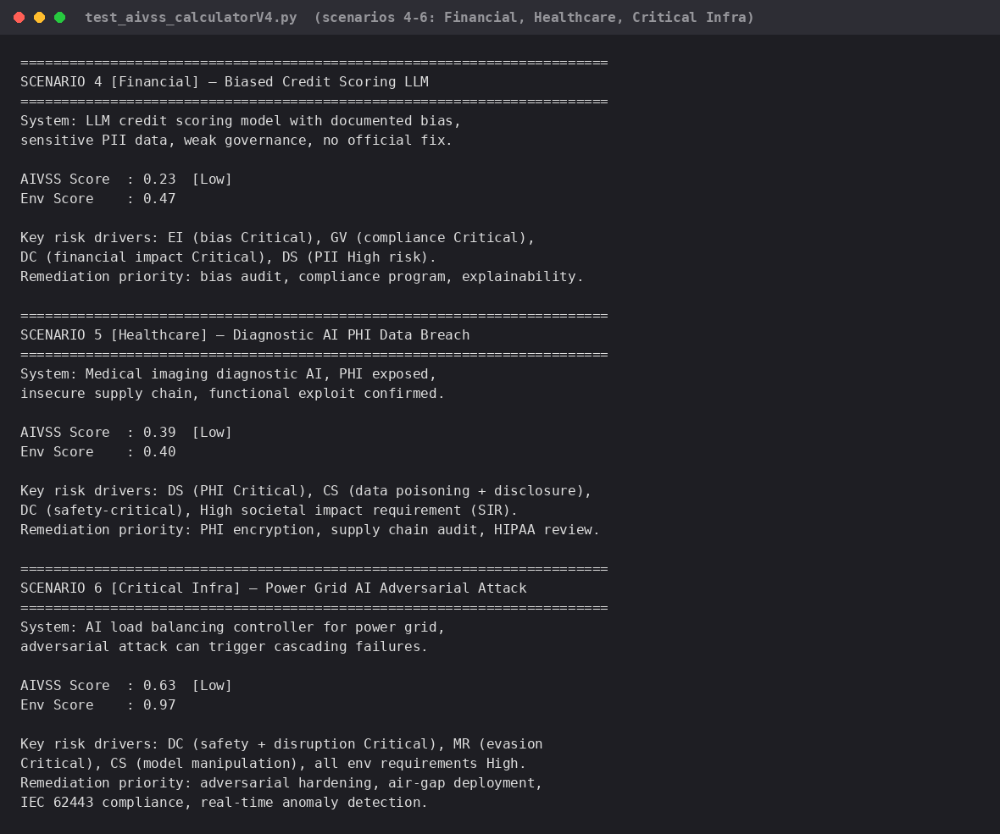
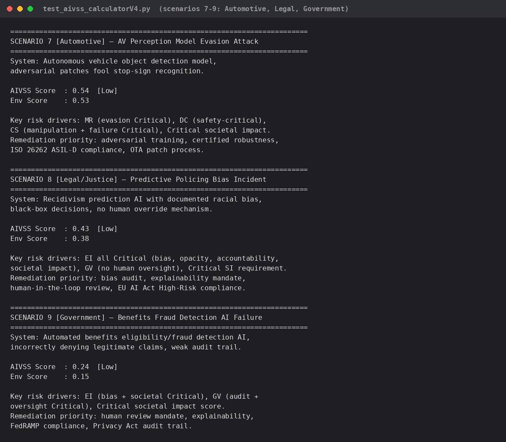
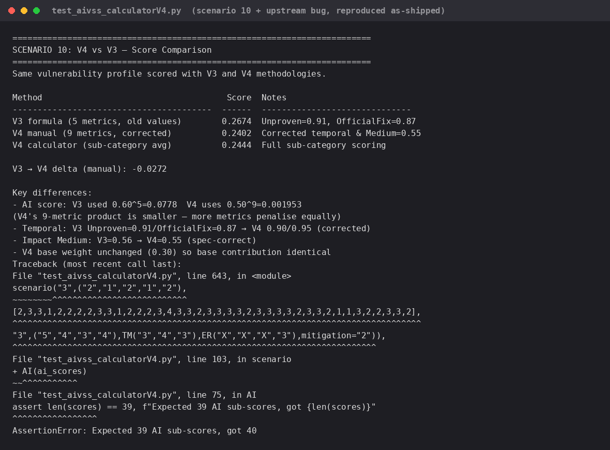

# OWASP's official general AIVSS framework — vendored, unmodified

**This is a different scoring formula from the rest of this repo.** Read
this before running anything in this folder.

## What this is

Unmodified copies of the code and documentation from OWASP's official
project repository, everything confirmed to be AI/AIVSS content (site
navigation, leadership, and contribution-process pages were left out as not
relevant):

- **Source:** [`OWASP/www-project-artificial-intelligence-vulnerability-scoring-system`](https://github.com/OWASP/www-project-artificial-intelligence-vulnerability-scoring-system)
- **Commit pinned:** `62fb0be849b028ace19089de771fd0bb42646543` (2026-04-10 —
  the same push that released the v0.8 PDF this repo is built on; there is
  no separate version number for this general framework, since its own
  README calls it "a living document")
- **Calculator code (this folder):** `aivss_calculatorV1.py`,
  `aivss_calculatorV2.py`, `aivss_calculatorV3.py`, `aivss_calculatorV4.py`,
  `test_aivss_calculatorV4.py` — copied byte-for-byte, no edits.
- **Reference documentation (`docs/`):** see "Reference documentation" below.
- **License:** the source repo's `LICENSE.md` is an unfilled template
  (`# TODO: Please update this file with the license of your project`) — no
  explicit code license. Treat as OWASP Foundation's content, attributed
  here; ask before redistributing outside this context, same as the rest of
  this repo's OWASP-sourced material (see root `README.md`
  "Source & Attribution").
- **Adapted from:**
  [`github.com/OWASP/www-project-artificial-intelligence-vulnerability-scoring-system`](https://github.com/OWASP/www-project-artificial-intelligence-vulnerability-scoring-system)
  and [`aivss.owasp.org/assets/publications/AIVSS Scoring System For OWASP Agentic AI Core Security Risks v0.8.pdf`](https://aivss.owasp.org/assets/publications/AIVSS%20Scoring%20System%20For%20OWASP%20Agentic%20AI%20Core%20Security%20Risks%20v0.8.pdf) —
  **this corresponds to v0.8 only.** If OWASP publishes a later version
  (v0.9, v1.0, ...), everything in this folder needs re-pulling and
  re-diffing against the new source; nothing here auto-updates.
- **Modified/adapted using Claude Code (Sonnet 5)** — the vendoring,
  organization into `docs/`, the formula-difference analysis, the
  non-interactive test harness (`run_calculators_demo.py`), and this
  documentation were all done via Claude Code; the calculator `.py`/`.md`/
  `.html` files themselves are byte-for-byte copies, not modified.

## Reference documentation (`docs/`)

Unmodified copies, same commit as above:

| File | What it is |
|---|---|
| `general_framework_README.md` | The full general-AIVSS methodology write-up (renamed from the source's `README.md` to avoid clashing with this folder's own README) — Sections 1-15, the source of the formula described above |
| `Financial-AIVSS.md` | Industry-specific application of the general framework to financial services (fraud detection, trading, credit scoring) |
| `Healthcare-AIVSS.md` | Industry-specific application to healthcare (diagnostics, PHI, patient safety) |
| `checklist.md` | AIVSS Assessment Checklist (general framework) |
| `Implementation_Details.md` | Implementation notes for the general framework |
| `AI Threat Taxonomies.md` | Cross-reference of AI threat taxonomies (CSA, MIT, OWASP Top 10 for LLMs, etc.) the general framework draws on |
| `ssvc.html` | The **AIVSS-SSVC Calculator** — a separate, complementary decision-tree tool. This one is directly referenced by the v0.8 PDF this repo is built on (page 51: *"a parallel but complementary effort... designed to be used together rather than as alternatives"*) — different inputs (P(Threat)/P(Vulnerability)/Impact), different output (a remediation-timeline category, not a 0-10 score), not a competing implementation of either AIVSS formula |
| `aiuc-aivss-crosswalk.md` | Mapping between AIVSS and the AIUC (AI Underwriting/Certification) control framework |
| `AIVSS-Chinese.md` | Chinese-language translation of the general framework README |

**Not vendored:** the interactive `aiuc-crosswalk/` web app (`app.js`,
`index.html`, `site_data.js`, `styles.css`) — it's a companion micro-site for
`aiuc-aivss-crosswalk.md`, not itself AIVSS content, and isn't runnable
outside a browser context. The markdown doc it's based on is included above.

## Why this is kept separate, not merged into the main skill set

The rest of this repo (`aivss_kg.py`'s `calculate_aivss()`, and every skill
that calls it) implements the **Primary AIVSS Scoring Equation** from
Section 3.4 of the *"AIVSS Scoring System For OWASP Agentic AI Core
Security Risks v0.8"* PDF:

```
AIVSS = (CVSS_Base + AARS) × Mitigation_Factor
AARS  = (10 − CVSS_Base) × (Factor_Sum / 10) × ThM
```

— a 10-factor "Risk Amplification Model" specific to agentic AI systems,
verified 10/10 against the PDF's own official worked examples (see the root
README's "Verified correctness" section).

**The calculators in this folder implement something else entirely** — the
*general* AIVSS framework documented in the source repo's top-level
`README.md` (a broader methodology for AI systems in general — LLMs, cloud
deployments — not agentic-specific):

```
AIVSS_Score = (w1 × ModifiedBaseScore + w2 × AISpecificMetrics + w3 × ImpactScore)
              × TemporalMetrics × MitigationMultiplier
```

with its own metric set (Modified Base Metrics MAV/MAC/MPR/MUI/MS, 9
AI-specific metrics MR/DS/EI/DC/AD/AA/LL/GV/CS averaged from 39
sub-categories, industry-specific weight profiles, Environmental Score).
**These two formulas do not produce comparable numbers.** Checked directly
against this repo's own OCR'd copy of the v0.8 PDF (all 98 pages): the terms
`ModifiedBaseScore` and `AISpecificMetrics` do not appear anywhere in that
document — this calculator's formula is not the one the PDF's worked
examples use.

**Do not treat a score from `aivss_calculatorV4.py` as equivalent to, or
cross-checkable against, this repo's `calculate_aivss()` / `aivss_score_finding`
output.** They are two different OWASP AIVSS artifacts that happen to share
a name, kept here side by side for reference and transparency, not as
interchangeable calculators for the same risk.

## Version history (per the source repo)

| File | Status | Notes |
|---|---|---|
| `aivss_calculatorV1.py` | Deprecated | Covers only 5 of 9 required AI-specific metrics, experimental weights (w1=0.4/w2=0.4/w3=0.2). Interactive-input only. |
| `aivss_calculatorV2.py` | Deprecated | Same 5-of-9 metric gap as V1; incorrect weights. |
| `aivss_calculatorV3.py` | Superseded by V4 | First implementation with all 9 AI-specific metrics, spec-correct weights (0.30/0.50/0.20), Temporal/Environmental metrics, MitigationMultiplier. |
| `aivss_calculatorV4.py` | **Recommended by OWASP** for this framework | Adds 7 industry profiles, 39 sub-category scoring (vs. one score per metric in V3), Modified Base Metrics with a "Not Defined" option, corrected Temporal/Impact values. |
| `test_aivss_calculatorV4.py` | Demonstration suite | 10 scenarios across industries. |

## Known issue in the as-shipped test file

Running `python3 test_aivss_calculatorV4.py` as committed by OWASP currently
raises `AssertionError: Expected 39 AI sub-scores, got 40` on scenario 3 —
one of the 10 demo scenarios passes a 40-item score list where the `AI()`
helper asserts exactly 39. This is a bug in the upstream file, reproduced
here unmodified (not fixed) to keep this an honest, unedited copy of the
source — verified on the pinned commit above, not something introduced by
copying it into this repo.

## Running these calculators

All five files are interactive CLI tools:

```bash
python3 aivss_calculatorV4.py
```

They prompt for input at each metric and print a score breakdown — nothing
in this folder is wired into `aivss_mcp_server.py` or any other tool in this
repo, by design (see "Why this is kept separate" above).

## Tested — all 4 versions actually run, not just read

`run_calculators_demo.py` (added for this repo, not a vendored OWASP file)
non-interactively drives V1/V2/V3 with the same conceptual "moderate-high
risk" scenario — network-accessible, low complexity, no privileges/user
interaction required, moderate-to-high AI-specific and impact metrics —
using the same stdin-patching technique OWASP's own
`test_aivss_calculatorV4.py` already uses for V4:

```bash
python3 run_calculators_demo.py          # V1, V2, V3
python3 test_aivss_calculatorV4.py       # V4's own official 10-scenario suite
```

| Version | Score | Severity | Notes |
|---|---|---|---|
| V1 | 0.49 | Low | Deprecated — 5 of 9 AI metrics, experimental weights |
| V2 | 0.58 | Low | Deprecated — same 5-metric gap, menu-driven input |
| V3 | 0.29 | Low | Full 9-metric formula — despite feeding "High severity" (0.80) on every one of the 9 AI-specific metrics plus high impact/environmental values, score still lands Low |
| V4 (official suite) | 0.23–0.63 across all 10 real-world scenarios | Low (every single one) | Financial bias, healthcare PHI breach, critical-infra grid attack, automotive AV evasion, legal bias, government fraud — all scored Low |
| V4 (official suite) | 0.91 | Low | Deliberate worst-case stress test — **all 39 AI sub-categories set to Critical** — still doesn't clear the Low→Medium boundary (4.0) |

**A genuine finding, not a setup error:** every version, including the
"recommended" V4 with real-world scenarios OWASP's own team wrote, compresses
scores toward the low end of the 0–10 scale. The multiplicative AI-metrics
term (`metric1 × metric2 × ... × metric9`) means even all-Critical
(0.90 per metric) only reaches `0.90^9 ≈ 0.39` before the industry weight is
applied — V4's own scenario-3 test comment acknowledges this directly:
*"Maintainers may wish to consider geometric mean as an alternative
aggregation method in a future spec revision."* This is a structural property
of the **general framework's** formula specifically — it does not affect
this repo's own `aivss_kg.calculate_aivss()` (the Agentic Core Risks
formula), which was separately verified to correctly reach High/Critical
severities across all 10 of the PDF's own official worked examples (see root
README's "Verified correctness").

**Known upstream bug, reproduced faithfully:** `test_aivss_calculatorV4.py`
as shipped by OWASP throws `AssertionError: Expected 39 AI sub-scores, got 40`
partway through its own summary-table step (one hardcoded scenario's score
list has an extra entry) — all 10 scenarios' narrative output prints
successfully before that; only the bonus summary table crashes. See "Known
issue in the as-shipped test file" above.

## Test run screenshots

Real terminal captures of every run referenced above — actual commands,
actual output, nothing staged. All in `test_screenshots/`.

### V1 — deprecated



### V2 — deprecated



### V3 — full 9-metric formula



### V4 — OWASP's own official demo suite (`test_aivss_calculatorV4.py`)

**Scenarios 1–3** (cross-industry comparison, sub-category hidden-risk
demo, severity-progression stress test):



**Scenarios 4–6** (Financial biased credit scoring, Healthcare PHI breach,
Critical Infrastructure grid attack):



**Scenarios 7–9** (Automotive AV evasion, Legal/Justice predictive-policing
bias, Government benefits-fraud failure):



**Scenario 10 (V4 vs. V3 comparison) + the upstream summary-table bug**,
reproduced as-shipped — file paths in the traceback are shown relative
(`test_aivss_calculatorV4.py`), not the actual local machine path used to
run it, since the absolute path is specific to whoever runs it and isn't
meaningful content:


