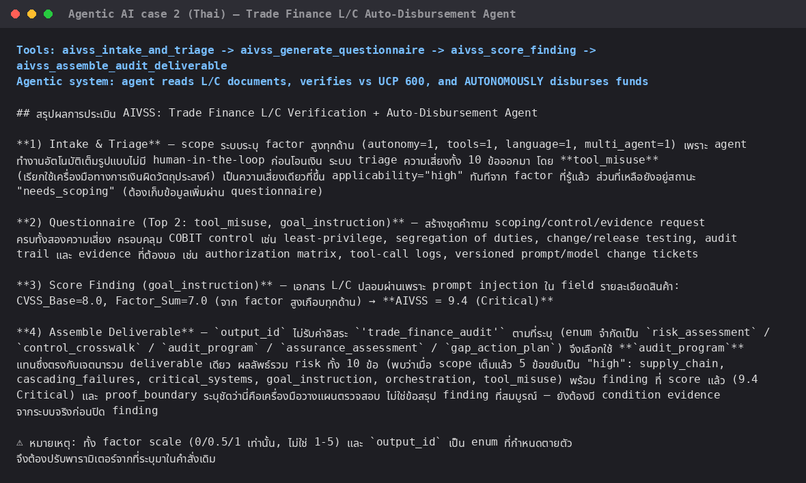
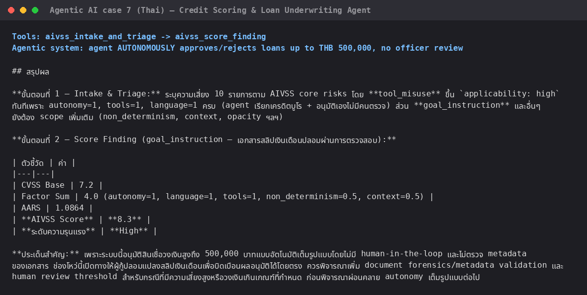
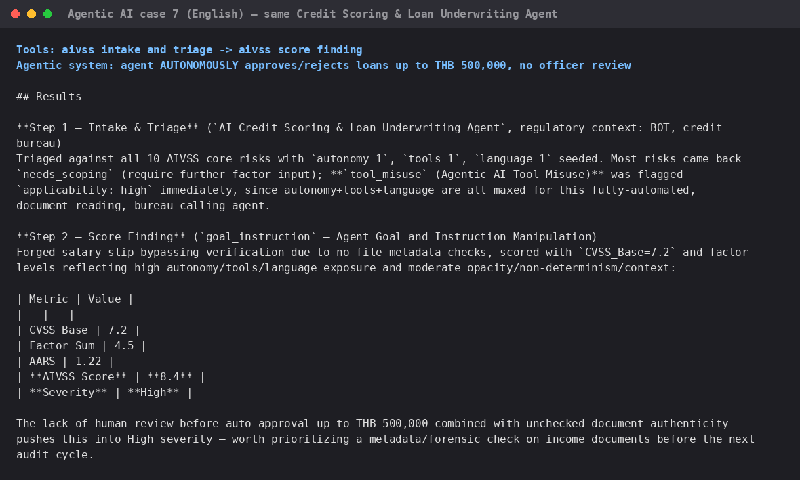

# Live test evidence — AIVSS assessed against real *agentic AI* cases

**AIVSS scores agentic AI systems specifically** — AI systems that act
autonomously, call tools, hold memory/context, or orchestrate other agents —
not general-purpose ML models or classifiers. Every scenario below was
deliberately chosen because it names a concrete **autonomous action** the AI
agent takes on its own (approve, disburse, freeze, trade, isolate a host,
inherit a role, ...), so the AIVSS risk taxonomy (Tool Misuse, Access
Control Violation, Goal & Instruction Manipulation, Cascading Failures, ...)
has something real to attach to. This gallery previously included two
tool-mechanics screenshots (a bare spec-search/scoring drill with no named
agent, and a catalog-provenance/drift check) that weren't scenario-driven —
those were removed so every image here maps to an actual autonomous-agent
case, not a generic "any AI" test.

Every screenshot is a real terminal capture — the actual command run and the
actual model output, nothing staged or hand-written. Each test ran against a
**brand-new `git clone`** of this repository (not the original authoring
project) using **non-interactive, newly-started Claude Code sessions**
(`claude -p ... --mcp-config .mcp.json`), to prove the packaging works for
someone who has never touched this project before.

## Setup

### 01 — Fresh clone + dependency install

`git clone`, inspect the committed `.mcp.json`, `pip install -r
requirements.txt`. No manual MCP registration step needed — the project-scoped
`.mcp.json` is picked up automatically when Claude Code opens in this
directory.

## Agentic AI case 1 — KYC Onboarding Chatbot (autonomous approval)

### 02 — `aivss_intake_and_triage`

Autonomous action: the chatbot **approves** low-risk onboarding **on its
own, with no human review**. First brand-new session after cloning — the
agent lists all 14 discovered `aivss_*` tools unprompted, then triages the
system and correctly surfaces Access Control Violation, Cascading Failures,
and Critical Systems Interaction as top risks.

## Agentic AI case 2 (Thai) — Trade Finance L/C Auto-Disbursement Agent

### 03 — `aivss_intake_and_triage` → `aivss_generate_questionnaire` → `aivss_score_finding` → `aivss_assemble_audit_deliverable`

Autonomous action: the agent verifies Letter-of-Credit documents against
UCP 600 and **disburses funds on its own**, no human in the loop. Scenario
sent entirely in **Thai**. Runs the full audit chain in one session: scope
→ triage (10 risks) → questionnaire for the top 2 → score a real finding
(forged L/C document via prompt injection, **AIVSS 9.4 Critical**) →
assemble into one deliverable.

**Finding from this test:** the agent first tried a free-text `output_id`
(`'trade_finance_audit'`); the tool rejected it because `output_id` is a
fixed enum, and the agent correctly substituted `audit_program`. Fail-closed
validation caught bad input instead of silently accepting it.

## Agentic AI case 3 — AML / Fraud Auto-Freeze Monitoring Agent

### 04 — `aivss_classify_banking_system`

Autonomous action: the agent scores transactions and **freezes accounts /
blocks transactions on its own**, no analyst review. Scenario sent in
**Thai**.

**Finding from this test (a real limitation, not staged):** the Thai-language
input returned `null` — no archetype matched. `classify_banking_system` is a
plain English-keyword classifier; it only matched once the agent rephrased
the same scenario in English keywords, landing correctly on
`fraud_transaction_monitoring`. Worth fixing if Thai-speaking users will call
this tool directly rather than through an LLM that rephrases first.

## Agentic AI case 4 — AI Treasury Dealing Assistant

### 05 — `aivss_design_review`

Autonomous action: the agent calls MCP-connected trading tools and **fires
FX/rate trade orders on its own**, straight from a trader's natural-language
instruction, with no second-trader confirmation. Returns ranked design
mitigations (grounded in the spec, not invented) plus the `narrative_prompt`
field shown verbatim.

## Agentic AI case 5 — Autonomous SOAR/EDR Incident-Response Agent

### 06 — `aivss_triage_threat_alert`

Autonomous action: a security agent that **isolates hosts / revokes
credentials on its own** directly from alert text, no analyst approval.
Deliberately **non-banking**, to check the taxonomy generalizes beyond the
banking-oriented corpus. No confident keyword match, but the semantic
fallback tier correctly surfaced `goal_instruction` / `cascading_failures` /
`memory_context` at `possible` confidence. (A second call in the same
session, sending an unrelated message with no agentic content at all,
confirmed the tool still fails closed to `null` rather than forcing a
match — omitted from this screenshot since it isn't itself an agentic-AI
case, but the behavior held.)

## Agentic AI case 6 — Agent That Inherited an Admin Role

### 07 — `aivss_draft_finding_rationale`, `aivss_related_risks`, `aivss_find_blind_spot_risks`, `aivss_graph_export`

Autonomous action: an agent **inherited an admin service-account role and
could approve its own permission changes** — a real access-control failure
mode of autonomous agents, not a generic IAM bug report. `draft_finding_rationale`
correctly flags `evidence_gap: true` even with `org_controls` supplied — a
bare list of control names isn't verified evidence. `related_risks` and
`find_blind_spot_risks` both surface `supply_chain` as structurally
entangled with `access_control` + `tool_misuse`, and `graph_export` returns
a 12-node/17-relation one-hop subgraph.

## Agentic AI case 7 — Same Credit Scoring & Loan Underwriting Agent, Thai vs. English

Autonomous action: the agent **auto-approves/rejects loans up to THB
500,000 on its own**, no loan-officer review — run through
`aivss_intake_and_triage` → `aivss_score_finding` in two independent fresh
sessions, one entirely in Thai and one entirely in English, to check the
skill set behaves consistently regardless of the caller's language.

### 08 — Thai

### 09 — English (same scenario)

**Both sessions agree on the substance:** `tool_misuse` triages as
`applicability: high` immediately in both languages, and the same finding —
a forged salary slip bypassing verification because the model doesn't check
file metadata — scores **8.3 High (Thai)** vs. **8.4 High (English)**. The
small numeric difference comes from the calling agent choosing
slightly-different-but-reasonable `factor_levels` each time, not from any
language-dependent behavior in the deterministic scoring tool itself. This
is a genuinely different result from case 3's `aivss_classify_banking_system`,
which is a free-text keyword classifier and *does* fail on Thai input — the
structured tools (intake/triage/scoring) are language-agnostic by design,
while that one free-text classifier tool is not.

## Summary

| Tool | Screenshot | Result |
|---|---|---|
| `aivss_intake_and_triage` | 02, 03, 08, 09 | ✅ (consistent across Thai and English callers) |
| `aivss_generate_questionnaire` | 03 | ✅ |
| `aivss_score_finding` | 03, 08, 09 | ✅ (Thai session 8.3 High vs. English session 8.4 High — same scenario, same substance) |
| `aivss_assemble_audit_deliverable` | 03 | ✅ (caught invalid `output_id`, self-corrected) |
| `aivss_classify_banking_system` | 04 | ⚠️ works, but Thai input fails closed to `null` — English-keyword only |
| `aivss_design_review` | 05 | ✅ |
| `aivss_triage_threat_alert` | 06 | ✅ (generalizes to non-banking via semantic fallback) |
| `aivss_draft_finding_rationale` | 07 | ✅ |
| `aivss_related_risks` | 07 | ✅ |
| `aivss_find_blind_spot_risks` | 07 | ✅ |
| `aivss_graph_export` | 07 | ✅ |
| `aivss_search_spec` | — | ✅ covered by the automated test suite (`test_aivss_spec_search.py`, 7/7) and used internally by `aivss_design_review`; not shown as its own agentic-case screenshot since it's a grounding utility, not an agent scenario |
| `aivss_cite_spec_reference` | — | ✅ same as above (used internally by `aivss_design_review`'s citations, `test_aivss_spec_search.py`) |
| `aivss_spec_provenance_report` | — | ✅ covered by `test_aivss_spec_provenance.py` (6/6); this tool checks the catalog's own integrity against the spec, not an agentic AI system, so it doesn't fit this case-driven gallery |

**11/14 tools have a dedicated agentic-AI-case screenshot; the remaining 3
are catalog/grounding utilities (not themselves agent scenarios) verified by
the automated test suite instead** — see the root
[README.md](../../README.md#verified-correctness) for full test counts
(88/88 unit tests, 17/17 real-protocol checks, 10/10 official OWASP
calculator scenarios).
