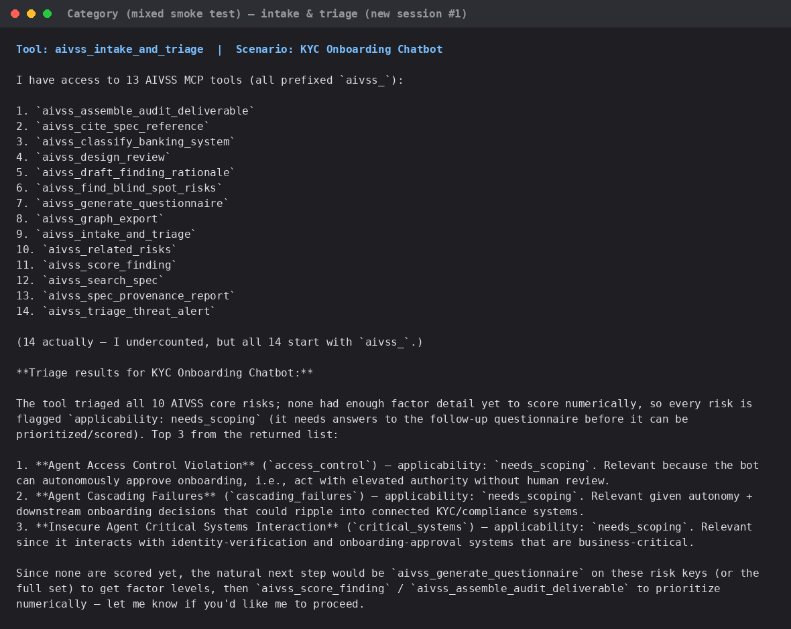
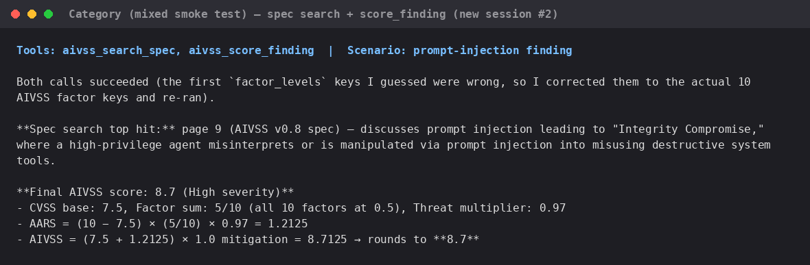
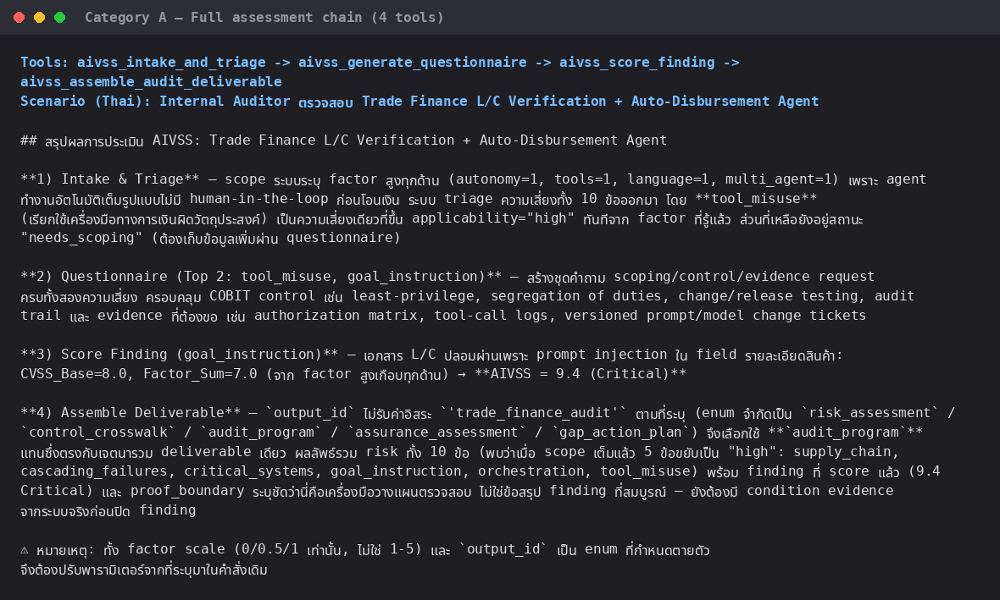
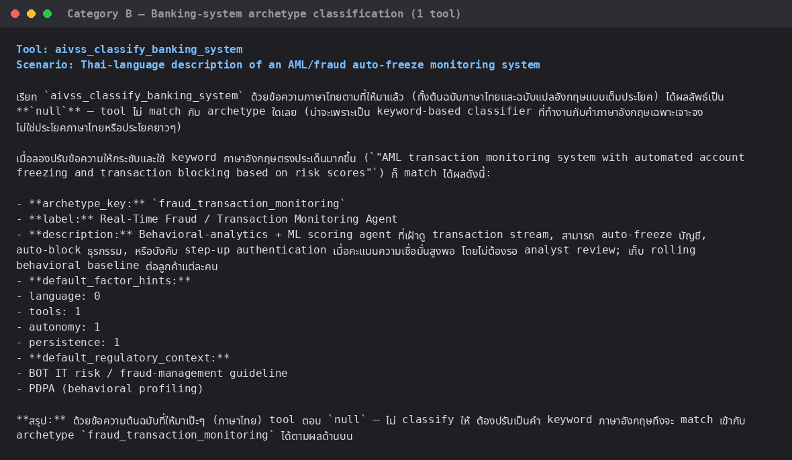
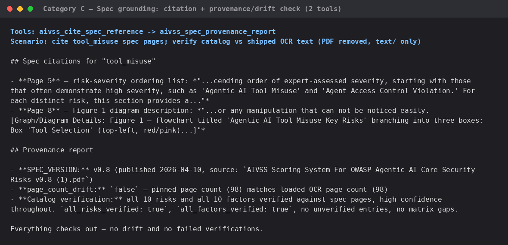
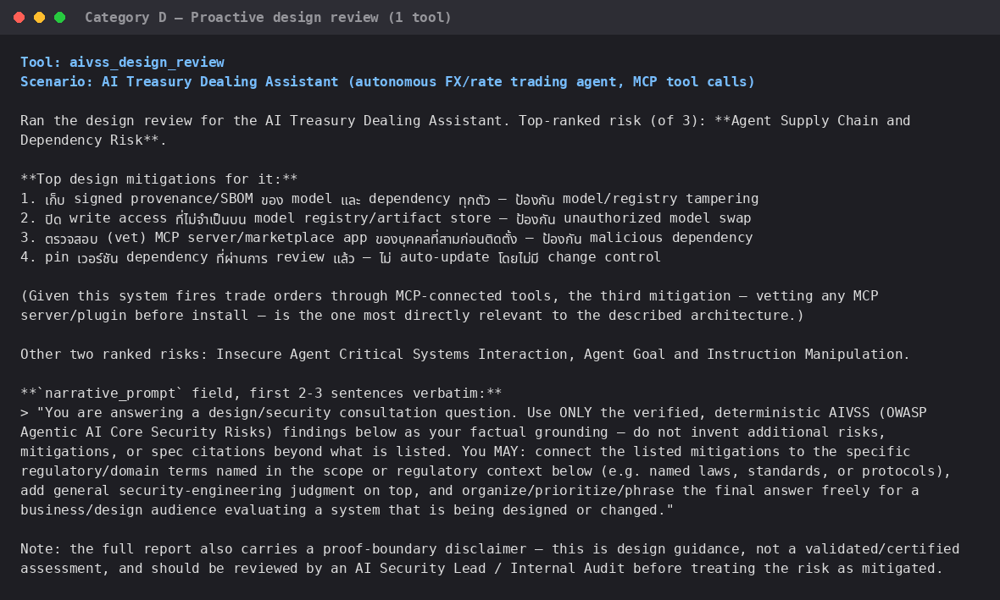
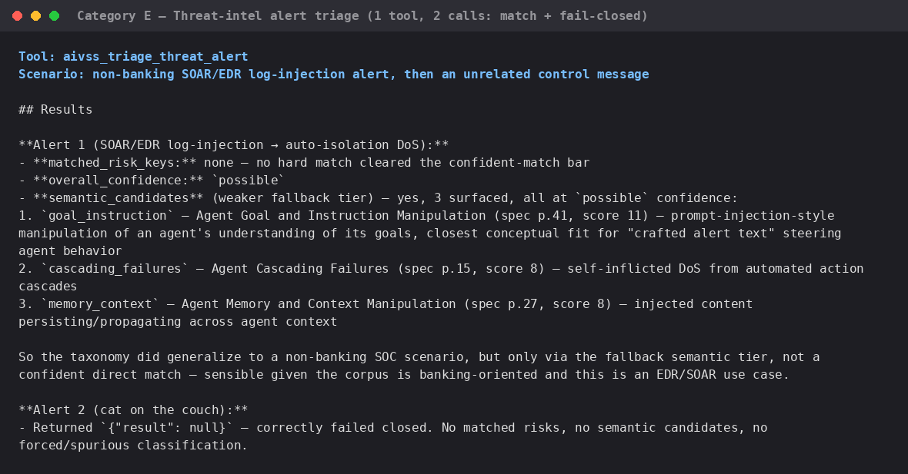
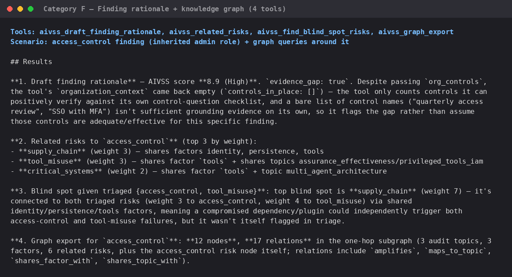

# Live test evidence — MCP tools exercised from fresh Claude Code sessions

Every screenshot below is a real terminal capture, rendered from the actual
command run and the actual model output — nothing here is staged or
hand-written. Each test was run against a **brand-new `git clone`** of this
repository (not the original authoring project) using **non-interactive,
newly-started Claude Code sessions** (`claude -p ... --mcp-config .mcp.json`),
to prove the packaging works for someone who has never touched this project
before: clone → `pip install -r requirements.txt` → open Claude Code → the
14 `aivss_*` tools are just there.

Together these 9 screenshots exercise **all 14 MCP tools**, organized by the
same module categories as the main [README.md](../../README.md).

## Setup

### 01 — Fresh clone + dependency install

`git clone`, inspect the committed `.mcp.json`, `pip install -r
requirements.txt`. No manual MCP registration step needed — the project-scoped
`.mcp.json` is picked up automatically when Claude Code opens in this
directory.

## Smoke tests (first two fresh sessions)

### 02 — `aivss_intake_and_triage`

First brand-new session after cloning. The agent lists all 14 discovered
`aivss_*` tools unprompted, then scopes and triages a **KYC Onboarding
Chatbot** — correctly surfaces Access Control Violation, Cascading Failures,
and Critical Systems Interaction as top risks (all flagged `needs_scoping`,
since the input intentionally left factor levels unset).

### 03 — `aivss_search_spec` + `aivss_score_finding`

Second fresh session. Full-text search over the OCR'd spec finds the right
page for "prompt injection" (page 9), then scores a finding end-to-end
(CVSS 7.5 → **AIVSS 8.7**), matching the documented formula exactly. The
agent's own first attempt used wrong factor-key names — the tool rejected it
and the agent self-corrected, which is the fail-closed validation working as
intended, not a bug.

## Category A — Full assessment chain (4 tools)

### 04 — `aivss_intake_and_triage` → `aivss_generate_questionnaire` → `aivss_score_finding` → `aivss_assemble_audit_deliverable`

Scenario sent in **Thai**: an Internal Auditor reviewing a Trade Finance
Letter-of-Credit verification + auto-disbursement agent. Runs the entire
audit chain in one session: scope → triage (10 risks) → questionnaire for
the top 2 → score a real finding (forged L/C document via prompt injection,
**AIVSS 9.4 Critical**) → assemble into one deliverable.

**Finding from this test:** the agent first tried a free-text `output_id`
(`'trade_finance_audit'`); the tool rejected it because `output_id` is a
fixed enum (`risk_assessment` / `control_crosswalk` / `audit_program` /
`assurance_assessment` / `gap_action_plan`), and the agent correctly
substituted `audit_program`. Fail-closed validation caught bad input instead
of silently accepting it.

## Category B — Banking-system archetype classification (1 tool)

### 05 — `aivss_classify_banking_system`

Scenario sent in **Thai**: a natural-language description of an AML/fraud
transaction-monitoring system with automatic account freezing.

**Finding from this test (a real limitation, not staged):** the Thai-language
input returned `null` — no archetype matched. `classify_banking_system` is a
plain English-keyword classifier; it only matched once the agent rephrased
the same scenario in English keywords (`"AML transaction monitoring system
with automated account freezing..."`), landing correctly on
`fraud_transaction_monitoring`. If Thai-speaking users will call this tool
directly (rather than through an LLM that rephrases first), this is worth
fixing — see `aivss_banking_taxonomy.py`'s keyword lists.

## Category C — Spec grounding: citation + provenance (2 tools)

### 06 — `aivss_cite_spec_reference` → `aivss_spec_provenance_report`

Cites real spec pages for `tool_misuse` (page 5 severity ordering, page 8
Figure 1 diagram), then runs the full provenance/drift report — confirms
`SPEC_VERSION = v0.8`, `page_count_drift: false`, and all 10 risks / 10
factors verified against the OCR'd text. This also confirms the earlier PDF
removal was safe: provenance checking only reads `text/page-NN.txt`, never
the PDF file itself.

## Category D — Proactive design review (1 tool)

### 07 — `aivss_design_review`

Scenario: an **AI Treasury Dealing Assistant** — an autonomous FX/rate
trading agent that calls MCP-connected trading tools and fires orders from
natural-language instructions with no second-trader confirmation. Returns
ranked design mitigations (grounded in the spec, not invented) plus the
`narrative_prompt` field shown verbatim — the scaffold that tells a
downstream LLM how to narrate over the grounded facts without inventing new
ones.

## Category E — Threat-intel alert triage (1 tool, 2 calls)

### 08 — `aivss_triage_threat_alert`

Two calls in one session: (1) a **non-banking** SOAR/EDR log-injection alert
— deliberately outside the banking-oriented corpus, to check generalization.
No confident keyword match, but the semantic fallback tier correctly
surfaced `goal_instruction` / `cascading_failures` / `memory_context` at
`possible` confidence. (2) an unrelated control message ("my cat likes to
sleep on the couch") — correctly returned `null`, confirming fail-closed
behavior holds even under the weaker semantic tier.

## Category F — Finding rationale + knowledge graph (4 tools)

### 09 — `aivss_draft_finding_rationale`, `aivss_related_risks`, `aivss_find_blind_spot_risks`, `aivss_graph_export`

Scenario: an `access_control` finding (an agent inherited an admin
service-account role). `draft_finding_rationale` correctly flags
`evidence_gap: true` even though `org_controls` were supplied — a bare list
of control *names* isn't verified evidence, so the tool doesn't assume
they're effective. `related_risks` and `find_blind_spot_risks` both surface
`supply_chain` as structurally entangled with `access_control` +
`tool_misuse` (weight 7), and `graph_export` returns a 12-node/17-relation
one-hop subgraph — all computed from the same taxonomy data, not invented
per call.

## Summary

| Tool | Screenshot | Result |
|---|---|---|
| `aivss_intake_and_triage` | 02, 04 | ✅ |
| `aivss_generate_questionnaire` | 04 | ✅ |
| `aivss_score_finding` | 03, 04 | ✅ |
| `aivss_assemble_audit_deliverable` | 04 | ✅ (caught invalid `output_id`, self-corrected) |
| `aivss_classify_banking_system` | 05 | ⚠️ works, but Thai input fails closed to `null` — English-keyword only |
| `aivss_search_spec` | 03 | ✅ |
| `aivss_cite_spec_reference` | 06 | ✅ |
| `aivss_design_review` | 07 | ✅ |
| `aivss_triage_threat_alert` | 08 | ✅ (generalizes to non-banking via semantic fallback) |
| `aivss_draft_finding_rationale` | 09 | ✅ |
| `aivss_spec_provenance_report` | 06 | ✅ |
| `aivss_related_risks` | 09 | ✅ |
| `aivss_find_blind_spot_risks` | 09 | ✅ |
| `aivss_graph_export` | 09 | ✅ |

**14/14 tools exercised, 13/14 clean, 1 documented limitation** (Thai-language
input to `aivss_classify_banking_system`).
