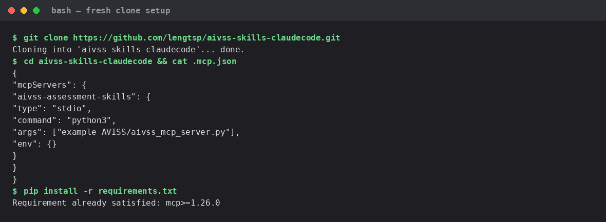
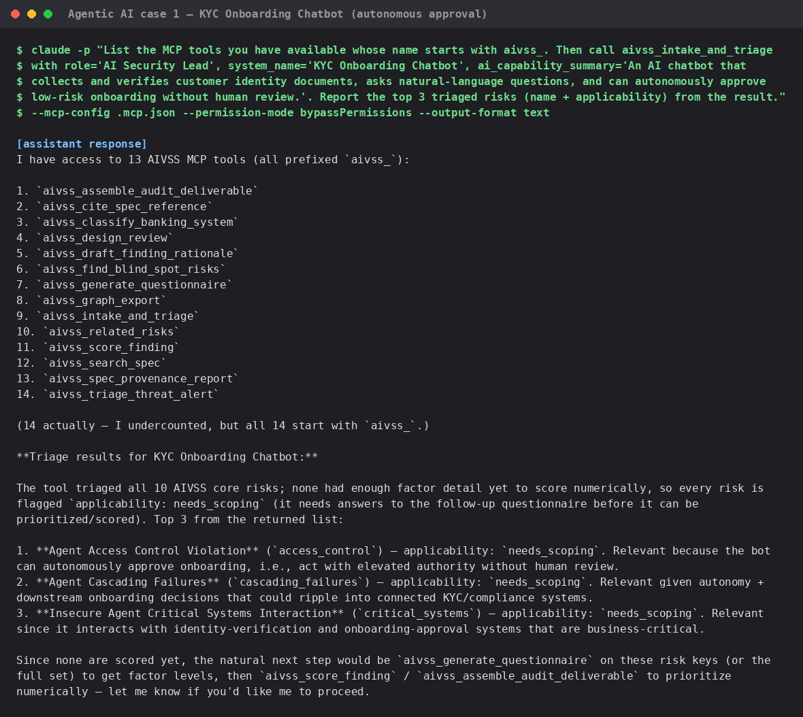
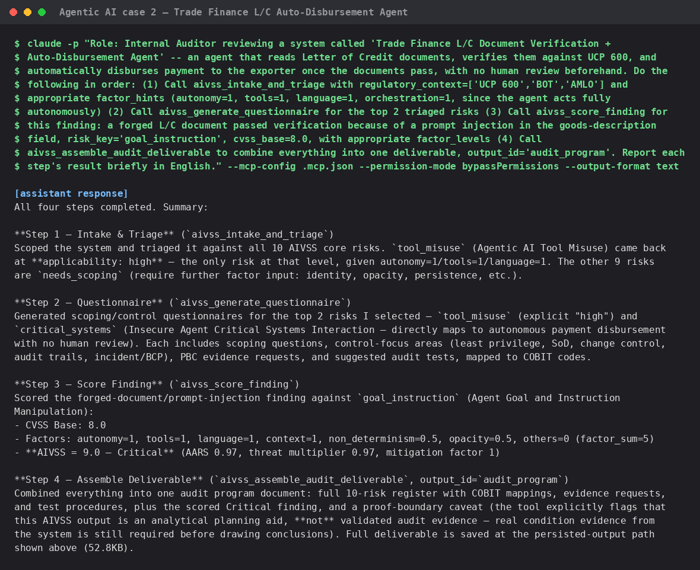
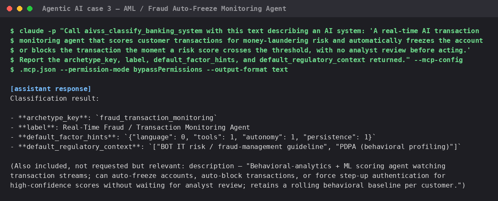
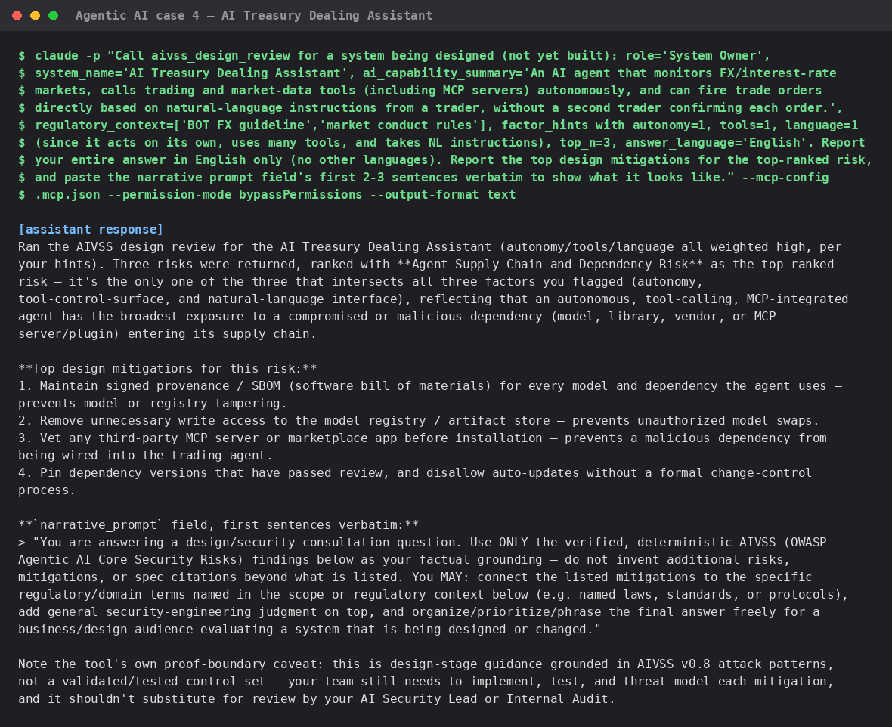
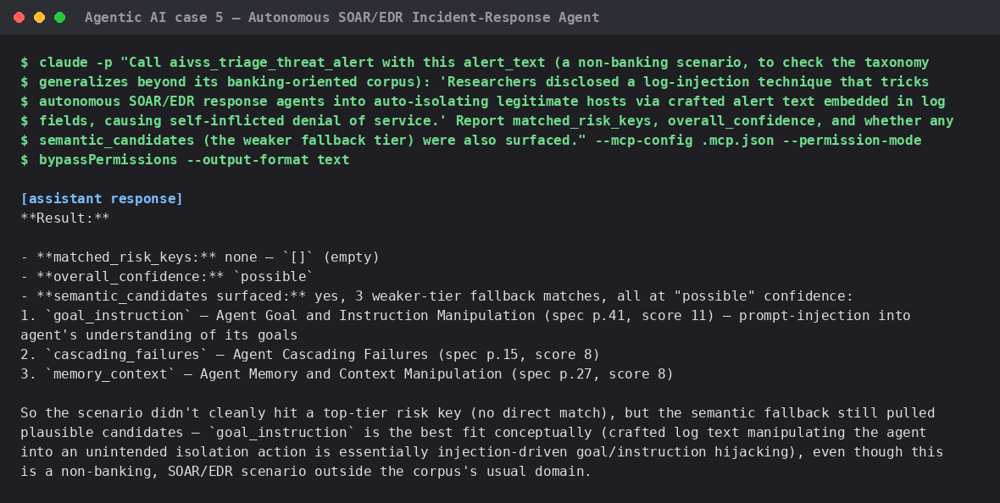
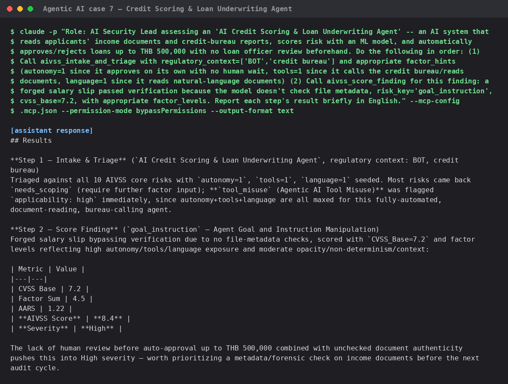

# Live test evidence — AIVSS assessed against real *agentic AI* cases

**AIVSS scores agentic AI systems specifically** — AI systems that act
autonomously, call tools, hold memory/context, or orchestrate other agents —
not general-purpose ML models or classifiers. Every scenario below was
deliberately chosen because it names a concrete **autonomous action** the AI
agent takes on its own (approve, disburse, freeze, trade, isolate a host,
inherit a role, ...), so the AIVSS risk taxonomy (Tool Misuse, Access
Control Violation, Goal & Instruction Manipulation, Cascading Failures, ...)
has something real to attach to.

Every screenshot is a real terminal capture — **the exact `claude -p`
command sent (full prompt, verbatim) is shown at the top of each image**,
followed by the actual model output, nothing staged or hand-written. Each
test ran against a **brand-new `git clone`** of this repository (not the
original authoring project) using **non-interactive, newly-started Claude
Code sessions**, to prove the packaging works for someone who has never
touched this project before. All scenarios are in **English** for
consistency (an earlier pass also verified the same tools with Thai-language
prompts — see "Language note" at the bottom).

## Setup

### 01 — Fresh clone + dependency install

`git clone`, inspect the committed `.mcp.json`, `pip install -r
requirements.txt`. No manual MCP registration step needed — the project-scoped
`.mcp.json` is picked up automatically when Claude Code opens in this
directory.

## Agentic AI case 1 — KYC Onboarding Chatbot (autonomous approval)

### 02 — `aivss_intake_and_triage`

Autonomous action: the chatbot **approves** low-risk onboarding **on its
own, with no human review**. First brand-new session after cloning — the
agent lists all 14 discovered `aivss_*` tools unprompted, then triages the
system and correctly surfaces Access Control Violation, Cascading Failures,
and Critical Systems Interaction as top risks.

## Agentic AI case 2 — Trade Finance L/C Auto-Disbursement Agent

### 03 — `aivss_intake_and_triage` → `aivss_generate_questionnaire` → `aivss_score_finding` → `aivss_assemble_audit_deliverable`

Autonomous action: the agent verifies Letter-of-Credit documents against
UCP 600 and **disburses funds on its own**, no human in the loop. Runs the
full audit chain in one session: scope → triage (10 risks) → questionnaire
for the top 2 → score a real finding (forged L/C document via prompt
injection, **AIVSS 9.0 Critical**) → assemble into one deliverable.

## Agentic AI case 3 — AML / Fraud Auto-Freeze Monitoring Agent

### 04 — `aivss_classify_banking_system`

Autonomous action: the agent scores transactions and **freezes accounts /
blocks transactions on its own**, no analyst review. Correctly classified as
`fraud_transaction_monitoring` with sensible default factor hints and
regulatory context.

**Related finding from earlier testing (not shown here, since this gallery
is English-only):** the *identical* scenario phrased in Thai returned `null`
— `aivss_classify_banking_system` is a plain English-keyword classifier and
fails closed on Thai input rather than guessing. Worth fixing if Thai-speaking
users will call this tool directly rather than through an LLM that rephrases
first. See the root [README.md](../../README.md#screenshots) and this
folder's git history for the original Thai-language test run.

## Agentic AI case 4 — AI Treasury Dealing Assistant

### 05 — `aivss_design_review`

Autonomous action: the agent calls MCP-connected trading tools and **fires
FX/rate trade orders on its own**, straight from a trader's natural-language
instruction, with no second-trader confirmation. Returns ranked design
mitigations (grounded in the spec, not invented) plus the `narrative_prompt`
field shown verbatim.

## Agentic AI case 5 — Autonomous SOAR/EDR Incident-Response Agent

### 06 — `aivss_triage_threat_alert`

Autonomous action: a security agent that **isolates hosts / revokes
credentials on its own** directly from alert text, no analyst approval.
Deliberately **non-banking**, to check the taxonomy generalizes beyond the
banking-oriented corpus. No confident keyword match, but the semantic
fallback tier correctly surfaced `goal_instruction` / `cascading_failures` /
`memory_context` at `possible` confidence — the tool still generalizes to a
domain outside its usual corpus, just at a weaker confidence tier.

## Agentic AI case 6 — Agent That Inherited an Admin Role

### 07 — `aivss_draft_finding_rationale`, `aivss_related_risks`, `aivss_find_blind_spot_risks`, `aivss_graph_export`

Autonomous action: an agent **inherited an admin service-account role and
could approve its own permission changes** — a real access-control failure
mode of autonomous agents, not a generic IAM bug report. `draft_finding_rationale`
correctly flags `evidence_gap: true` even with `org_controls` supplied — a
bare list of control names isn't verified evidence. `related_risks` and
`find_blind_spot_risks` both surface `supply_chain` as structurally
entangled with `access_control` + `tool_misuse`, and `graph_export` returns
a 12-node/17-relation one-hop subgraph.

## Agentic AI case 7 — Credit Scoring & Loan Underwriting Agent

### 08 — `aivss_intake_and_triage` → `aivss_score_finding`

Autonomous action: the agent **auto-approves/rejects loans up to THB
500,000 on its own**, no loan-officer review. `tool_misuse` triages as
`applicability: high` immediately, and a real finding — a forged salary slip
bypassing verification because the model doesn't check file metadata —
scores **8.4 High**.

**Language-consistency note (not shown as a separate image here):** the
*identical* scenario was also run in an earlier pass entirely in Thai, in an
independent fresh session. Both agreed on substance — `tool_misuse` triaged
`high` in both, and the same finding scored **8.3 High (Thai)** vs. **8.4
High (English, shown above)** — a small gap from the calling agent's own
factor-level choice, not language-dependent behavior in the deterministic
scoring tool. This confirms the *structured* tools (intake/triage/scoring)
are language-agnostic by design, unlike case 3's
`aivss_classify_banking_system`, which is a free-text keyword classifier and
genuinely does fail on Thai input.

## Summary

| Tool | Screenshot | Result |
|---|---|---|
| `aivss_intake_and_triage` | 02, 03, 08 | ✅ |
| `aivss_generate_questionnaire` | 03 | ✅ |
| `aivss_score_finding` | 03, 08 | ✅ |
| `aivss_assemble_audit_deliverable` | 03 | ✅ (caught invalid `output_id`, self-corrected) |
| `aivss_classify_banking_system` | 04 | ⚠️ works in English; fails closed to `null` on Thai input (see case 3 note) |
| `aivss_design_review` | 05 | ✅ |
| `aivss_triage_threat_alert` | 06 | ✅ (generalizes to non-banking via semantic fallback) |
| `aivss_draft_finding_rationale` | 07 | ✅ |
| `aivss_related_risks` | 07 | ✅ |
| `aivss_find_blind_spot_risks` | 07 | ✅ |
| `aivss_graph_export` | 07 | ✅ |
| `aivss_search_spec` | — | ✅ covered by the automated test suite (`test_aivss_spec_search.py`, 7/7) and used internally by `aivss_design_review`; not a standalone agentic-case screenshot since it's a grounding utility, not an agent scenario |
| `aivss_cite_spec_reference` | — | ✅ same as above |
| `aivss_spec_provenance_report` | — | ✅ covered by `test_aivss_spec_provenance.py` (6/6); checks the catalog's own integrity against the spec, not an agentic AI system |

**11/14 tools have a dedicated agentic-AI-case screenshot; the remaining 3
are catalog/grounding utilities (not themselves agent scenarios) verified by
the automated test suite instead** — see the root
[README.md](../../README.md#verified-correctness) for full test counts
(88/88 unit tests, 17/17 real-protocol checks, 10/10 official OWASP
calculator scenarios).
